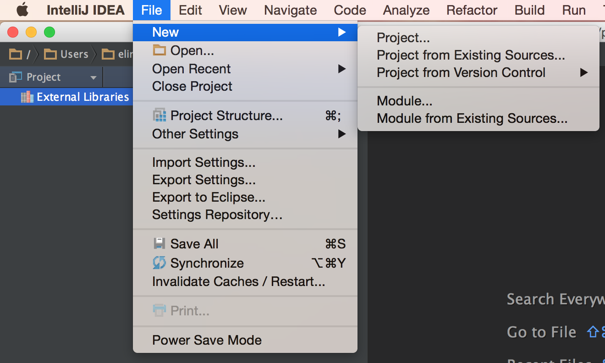
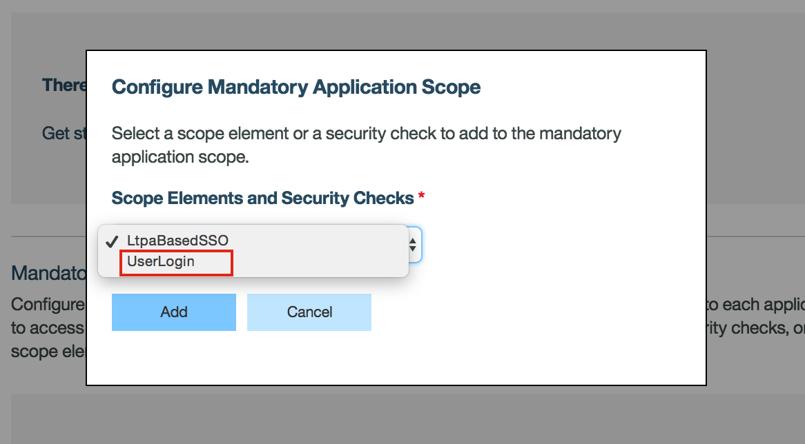
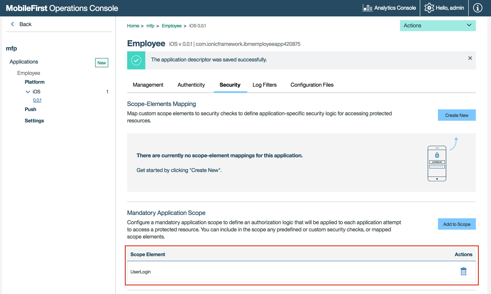

- - -
# Lab 10 - How to secure your application (Server side)

The MobileFirst Platform Foundation authentication framework uses the **OAuth 2.0** protocol. The OAuth 2 protocol is based on the acquisition of an access token that encapsulates the granted permissions to the client.

In that context, the IBM MobileFirst Platform Server serves as an authorization server and is able to generate access tokens. The client can then use these tokens to access resources on a resource server, which can be either the MobileFirst Server itself or an external server. 

The resource server checks the validity of the token to make sure that the client can be granted access to the requested resource. The separation between resource server and authorization server allows to enforce security on resources that are running outside MobileFirst Server.

**Security Check**
A security check is an entity that is responsible for obtaining and validating client credentials.
Security checks are instantiated by Adapters.

The security check defines the process to be used to authenticate users. It is often associated with a SecurityCheckConfiguration that defines properties to be used by the security check.
The same security check can also be used to protect several resources.

On the client-side, the application logic needs to implement a challenge handler to handle challenges sent by the security check.

In this lab we are going to use the **CredentialsValidationSecurityCheck** which fit the most common use-cases of simple user authentication. In addition to validating the credentials, it creates a user identity that will be accessible from various parts of the framework, allowing you to identify the current user. Optionally, UserAuthenticationSecurityCheck also provides Remember Me capabilities.

In this lab we going to use the IntelliJ IDEA to create a new security check asking for a username and password and uses the username to represent an authenticated user.

## Steps:
### Create new adapter using IntelliJ IDEA

1. Start the IntelliJ Idea
2. Go to File → New → Project 
	
	

3. Select the Maven tab 

	

4. Select or add the MobileFirst adapter Archetype, if this is the first time you creating an mfp-adapter you will need to add the MobileFirst adapter Archetype.

5. Check the "Create from archetype" check box and click the Add Archetype button. 

	

6. Provide the following details below and press the "OK" button.

		GroupId: com.ibm.mfp
		ArtifactId: adapter-maven-archetype-java
		Version: 8.0.0

	

7. From the list select the "adapter-maven-archetype-java" and click Next.

	

8. Specify the required GroupId, ArtifactId and Version and click Next.

		GroupId: com.ibm
		ArtifactId: UserLogin
		Version: 1.0-SNAPSHOT

	

9. In the following page, click Next.

	

10. Provide project name and location and click Finish
Create a new adapter 
	
		Project name: UserLogin
		Project location: YOUR_DIR/AdapterServices/UserLogin

	

11. Click "Ok" to create a new directory.

	

11. Click the "New Window" button

	

12. If you get an alert in the right top corner that the MAven projects need to be imported click on the "Import Changes" link

	

13. Let's look at the project folder.

  

14. Expend the **UserLogin/src/main/java/com.ibm** you will see java classes: 
	- UserLoginApplication.java
	- UserLoginResource.java

15. Select both files and then press the Right Click of your mouse and click Delete.

  

16. Click the "OK" button to confirm delete of the files.

  

17. Click the "Delete anyway" button to confirm delete of the files.

  

17. Create a new java class.
18. Select the **com.ibm** folder and press the right click of your mouse

  
	
19. Name the class **UserLoginSecurityCheck** and click the "OK" button.
 
  

20. **Select** the new class UserLoginSecurityCheck.java and in the editor window select the content of the class using Ctrl+A and press the delete key to delete the content of the class.
21.  **Copy** the following code instead

	
		package com.ibm;

		import com.ibm.mfp.server.registration.external.model.AuthenticatedUser;
		import com.ibm.mfp.security.checks.base.UserAuthenticationSecurityCheck;

		import java.util.HashMap;
		import java.util.Map;
		
		public class UserLoginSecurityCheck extends UserAuthenticationSecurityCheck {
	
	    @Override
	    protected AuthenticatedUser createUser() {
	        return null;
	    }
	
	    @Override
	    protected boolean validateCredentials(Map<String, Object> credentials) {
	        return false;
	    }
	
	    @Override
	    protected Map<String, Object> createChallenge() {
	        return null;
	    }
		}

	
### Create the challenge

1. Copy the following code and replace the **createChallenge()** method

		@Override
		protected Map<String, Object> createChallenge() {
			Map challenge = new HashMap();
			challenge.put("errorMsg",errorMsg);
			challenge.put("remainingAttempts",getRemainingAttempts());
			return challenge;
		}

### Validating the user credentials
When the client sends the challenge's answer, the answer is passed to **validateCredentials** as a Map. This method should implement your logic and return true if the credentials are valid.

In this example, credentials are considered "valid" when username and password are the same:

		@Override
		protected boolean validateCredentials(Map<String, Object> credentials) {
		    if(credentials!=null && credentials.containsKey("username") && credentials.containsKey("password")){
		        String username = credentials.get("username").toString();
		        String password = credentials.get("password").toString();
		        if(!username.isEmpty() && !password.isEmpty() && username.equals(password)) {
		            return true;
		        }
		        else {
		            errorMsg = "Wrong Credentials";
		        }
		    }
		    else{
		        errorMsg = "Credentials not set properly";
		    }
		    return false;
		}		

### Creating the AuthenticatedUser object
The **UserAuthenticationSecurityCheck** stores a representation of the current client (user, device, application) in persistent data, allowing you to retrieve the current user in various parts of your code, such as the challenge handlers or the adapters. Users are represented by an instance of the class AuthenticatedUser. Its constructor receives a id, displayName and securityCheckName.

In this example, we are using the username for both the id and displayName.

1. First, add the following three variables, just below the class definition 

	*public class UserLoginSecurityCheck extends UserAuthenticationSecurityCheck {* :

		private String userId, displayName;
		private String errorMsg;

  

1. Modify the validateCredentials method to save the username:
		
		@Override
		protected boolean validateCredentials(Map<String, Object> credentials) {
		if(credentials!=null && credentials.containsKey("username") && credentials.containsKey("password")){
		    String username = credentials.get("username").toString();
		    String password = credentials.get("password").toString();
		    if(!username.isEmpty() && !password.isEmpty() && username.equals(password)) {
		        userId = username;
		        displayName = username;
		        return true;
		    }
		    else {
		        errorMsg = "Wrong Credentials";
		    }
		}
		else{
		    errorMsg = "Credentials not set properly";
		}
		return false;
		}

2. Then, override the createUser method to return a new instance of AuthenticatedUser:

		@Override
		protected AuthenticatedUser createUser() {
		    return new AuthenticatedUser(userId, displayName, this.getName());
		}

You can use **this.getName()** to get the current security check name.

> Note **UserAuthenticationSecurityCheck** will call your **createUser()** implementation after a successful validateCredentials.

### Configuring the SecurityCheck

1. **Open** the **adapter.xml** under **UserLogin/src/main/adapter-resources/adapter.xml** 
2. in the adapter.xml file, find the **< JAXRSApplicationClass > com.ibm.UserLoginApplication </ JAXRSApplicationClass >** and delete it from the file
3. In the adapter.xml file, add a **< securityCheckDefinition >** element:

		<securityCheckDefinition name="UserLogin" class="com.ibm.UserLoginSecurityCheck">
		<property name="maxAttempts" defaultValue="3" displayName="How many attempts are allowed"/>
		<property name="blockedStateExpirationSec" defaultValue="10" displayName="How long before the client can try again (seconds)"/>
		<property name="successStateExpirationSec" defaultValue="60" displayName="How long is a successful state valid for (seconds)"/>
		</securityCheckDefinition>

 >Note: The **securityCheckDefinition** attributes allow you to dynamically change/set the attribute within the MFP web console.
  	
 
 Your **adapter.xml** should look like this:
 
 **Before**

  	

 **After**
   	
   	

 >Note: The class should point to the com.ibm.UserLoginSecurityCheck java calss **"com.ibm.UserLoginSecurityCheck"** 

4. Your new class should look like this:

   	
	

5. **Save** your changes

### Deploy the adapter using Maven tools.
In the previous labs we deploy the adapter using the mfpdev adapter deploy command, in this lab we are going to use the Maven tools to build the adapter and deploy it to the MFP server.

1. Go to View → Tool Windows → Maven Projects:
		

2. You should see on the right side the Maven projects, click on the **UserLogin** to expend the project tree.

	

3. **Build** - Click on Lifecycle and double click the **install** command.
	
	>Note: if you look at the terminal window in the bottom you will see **BUILD SUCCESS** message

4. **Deploy** - Click on Plugins → adapter and double click the **adapter:deploy** command.
**Deploy** the new adapter to the console.

	>Note: if you look at the terminal window in the bottom you will see **BUILD SUCCESS** message
	

5. If we look at the MFP console we can see that the adapter **UserLogin** was successfully deployed.
	
	

### Mandatory application scope

At the application level, you can define a scope that will apply to all the resources used by this application.

1. In the MobileFirst Operations Console, select **Employee**  app then select the → **Security** tab. Under Mandatory Application Scope click on Add to Scope.
	
	
2. In the drop down list selete the **UserLogin** scope
	

3. **Press** the "Add" button
	
	

4. **Run** the following command to start the application 
		
		cordova prepare
		cordova emulate
	
5. You have noticed that nothing happened after you press he login button, if you look at the debugger area within xcode you can see the following message: **Failed to connect to MobileFirst Server
**

	

### Summary
We learn how to use the IntelliJ IDEA to create a new Maven project and easy build & deploy the adapter to the MFP console.

Now that you set **Mandatory application scope** vs **DEFAULT_SCOPE** the application cannot access the MobileFirst server unless the server validate the user first and issue a token, in the next lab we are going to modify the client side log to in-order to validate the user and gain access to the server and the adapter.

### In case you got lost on the way

You can easily get to this stage by running the following command :

     git checkout -f step-10

