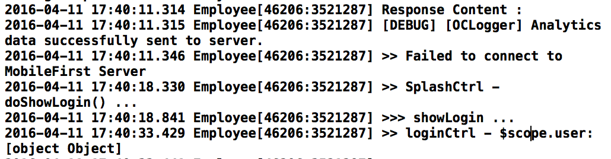

- - -
# Lab 10 - How to secure your application (Server side)

The MobileFirst Platform Foundation authentication framework uses the **OAuth 2.0** protocol. The OAuth 2 protocol is based on the acquisition of an access token that encapsulates the granted permissions to the client.

In that context, the IBM MobileFirst Platform Server serves as an authorization server and is able to generate access tokens. The client can then use these tokens to access resources on a resource server, which can be either the MobileFirst Server itself or an external server. 

The resource server checks the validity of the token to make sure that the client can be granted access to the requested resource. The separation between resource server and authorization server allows to enforce security on resources that are running outside MobileFirst Server.

**Security Check**
A security check is an entity that is responsible for obtaining and validating client credentials.
Security checks are instantiated by Adapters.

The security check defines the process to be used to authenticate users. It is often associated with a SecurityCheckConfiguration that defines properties to be used by the security check.
The same security check can also be used to protect several resources.

On the client-side, the application logic needs to implement a challenge handler to handle challenges sent by the security check.

In this lab we are going to use the **CredentialsValidationSecurityCheck** which fit the most common use-cases of simple user authentication. In addition to validating the credentials, it creates a user identity that will be accessible from various parts of the framework, allowing you to identify the current user. Optionally, UserAuthenticationSecurityCheck also provides Remember Me capabilities.

In this labe we going to use a security check asking for a username and password and uses the username to represent an authenticated user.

## Steps:
### Create new adapter

1. In the console nevigate to **AdapterServices** folder 

2. Create a new adapter 

        mfpdev adapter create

3. Enter the adaptr name: **UserLogin**
4. Select an adapter type **(Java)** using the arrows and the enter keys
5. Enter an adapter package For example: **com.ibm**
6. Enter a Group Id of the Maven project to be build: **com.ibm**

  

7. Change the direcotry to **UserLogin**

        cd UserLogin

  

8. Let's look at the UserLogin folder

  

9. Open the UserLogin folder with your favorite IDE
10. Delete both of the files : 
	- UserLoginApplication.java
	- UserLoginResource.java
	
11. Create a new java calss name it called **UserLoginSecurityCheck.java**
12. **Open** the UserLoginSecurityCheck.java under **UserLogin/src/main/java/com/ibm/UserLoginSecurityCheck.java**
12. **Copy** the following code 

	
		package com.ibm;

		import com.ibm.mfp.server.registration.external.model.AuthenticatedUser;
		import com.ibm.mfp.security.checks.base.UserAuthenticationSecurityCheck;

		import java.util.HashMap;
		import java.util.Map;
		
		public class UserLogin extends UserAuthenticationSecurityCheck {
	
	    @Override
	    protected AuthenticatedUser createUser() {
	        return null;
	    }
	
	    @Override
	    protected boolean validateCredentials(Map<String, Object> credentials) {
	        return false;
	    }
	
	    @Override
	    protected Map<String, Object> createChallenge() {
	        return null;
	    }
		}

	
### Create the challenge

1. Copy the following code and replace the **createChallenge()** method

		@Override
		protected Map<String, Object> createChallenge() {
			Map challenge = new HashMap();
			challenge.put("errorMsg",errorMsg);
			challenge.put("remainingAttempts",getRemainingAttempts());
			return challenge;
		}

### Validating the user credentials
When the client sends the challenge's answer, the answer is passed to **validateCredentials** as a Map. This method should implement your logic and return true if the credentials are valid.

In this example, credentials are considered "valid" when username and password are the same:

		@Override
		protected boolean validateCredentials(Map<String, Object> credentials) {
		    if(credentials!=null && credentials.containsKey("username") && credentials.containsKey("password")){
		        String username = credentials.get("username").toString();
		        String password = credentials.get("password").toString();
		        if(!username.isEmpty() && !password.isEmpty() && username.equals(password)) {
		            return true;
		        }
		        else {
		            errorMsg = "Wrong Credentials";
		        }
		    }
		    else{
		        errorMsg = "Credentials not set properly";
		    }
		    return false;
		}		

### Creating the AuthenticatedUser object
The **UserAuthenticationSecurityCheck** stores a representation of the current client (user, device, application) in persistent data, allowing you to retrieve the current user in various parts of your code, such as the challenge handlers or the adapters. Users are represented by an instance of the class AuthenticatedUser. Its constructor receives a id, displayName and securityCheckName.

In this example, we are using the username for both the id and displayName.

1. First, modify the validateCredentials method to save the username:

		private String userId, displayName;
		@Override
		protected boolean validateCredentials(Map<String, Object> credentials) {
		if(credentials!=null && credentials.containsKey("username") && credentials.containsKey("password")){
		    String username = credentials.get("username").toString();
		    String password = credentials.get("password").toString();
		    if(!username.isEmpty() && !password.isEmpty() && username.equals(password)) {
		        userId = username;
		        displayName = username;
		        return true;
		    }
		    else {
		        errorMsg = "Wrong Credentials";
		    }
		}
		else{
		    errorMsg = "Credentials not set properly";
		}
		return false;
		}

2. Then, override the createUser method to return a new instance of AuthenticatedUser:

		@Override
		protected AuthenticatedUser createUser() {
		    return new AuthenticatedUser(userId, displayName, this.getName());
		}

You can use **this.getName()** to get the current security check name.

> Note **UserAuthenticationSecurityCheck** will call your **createUser()** implementation after a successful validateCredentials.

### Configuring the SecurityCheck

1. **Open** the **adapter.xml** under **UserLogin/src/main/adapter-resources/adapter.xml** 
2. n the adapter.xml file, find the **<JAXRSApplicationClass>com.ibm.UserLoginApplication</JAXRSApplicationClass>** and delete it from the file
3. In the adapter.xml file, add a <securityCheckDefinition> element:

		<securityCheckDefinition name="UserLogin" class="com.ibm.UserLogin">
		  <property name="maxAttempts" defaultValue="3" description="How many attempts are allowed"/>
		  <property name="blockedStateExpirationSec" defaultValue="10" description="How long before the client can try again (seconds)"/>
		  <property name="successStateExpirationSec" defaultValue="60" description="How long is a successful state valid for (seconds)"/>
		  <property name="rememberMeDurationSec" defaultValue="120" description="How long is the user remembered when using RememberMe (seconds)"/>
		</securityCheckDefinition>

 Your **adapter.xml** should look like this:
 
 **Before**

  	

 **After**
   	
   	

4. Your new class should look like this:

   	
	

5. **Save** your changes
6. **Deploy** the new adapter to the console.
	
		mfpdev adapter build
		mfpdev adapter deploy

	

7. If we look at the MFP console we can see that the adapter **UserLogin** was successfully deployed.
	
	

### Mandatory application scope

At the application level, you can define a scope that will apply to all the resources used by this application.

1. In the MobileFirst Operations Console, select **Employee**  app then select the → **Security** tab. Under Mandatory Application Scope click on Add to Scope.
	
	
2. In the drop down list selete the **UserLogin** scope
	

3. **Press** the "Add" button
	
	

4. **Run** the following command to start the application 
		
		cordova prepare
		cordova emulate
	
5. You have noticed that nothing happend after you press he login button, if you look at the debugger area within xcode you can see the following message: **Failed to connect to MobileFirst Server
**

	

### Summary
Now that you set **Mandatory application scope** vs **Default_scope** the application cannot access the MobileFirst server unless the server validate the user first and issue a token, in the next lab we are going to modify the client side log to in-order to validate the user and gain access to the server and the adapter.

### In case you got lost on the way

You can easily get to this stage by running the following command :

     git checkout -f step-10

