- - -
# Lab 11 - How to secure your application (Client side)

In the previous lab we update the application **Mandatory application scope** to validate the user before we issue token.
In this lab we are going to modify the client side app to send the credentials when the application start.
We going to implement a challenge handler, The challenge handler will demonstrate a few additional features (APIs) such as the **preemptive login, logout** and obtainAccessToken.

>Note:  For this lab there are snippets files included in the **/snippets** folder of your workspace which can be used to quickly copy/paste the large source code changes in the lab steps below.

## Steps:
### Update the wlClientInit

1. Open the **app.js** file and change the **wlClientInit()** method, remove the snippets file and copy the WLAuthorizationManager.obtainAccessToken() block

	**Before**
	  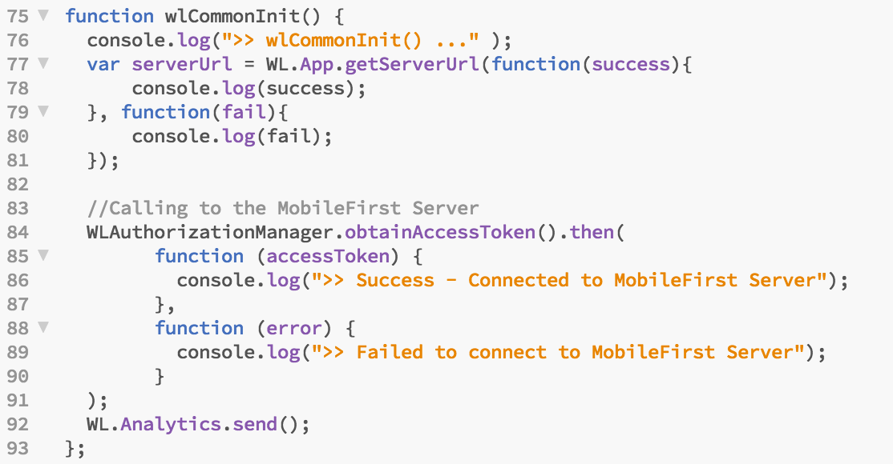
	
	**After**
	  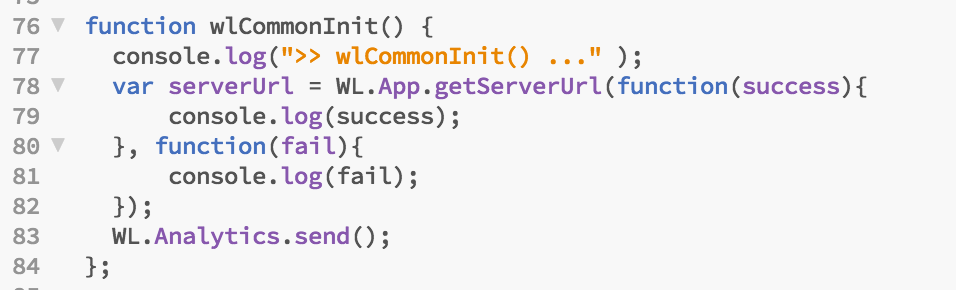

	>Note:  We going to obtain a access token when we inside the new implementation of the login method in the next steps.

	### Create new challenge handler

2. Open the **controllers.js**  and change the look for the **ibmApp.controller('splashCtrl'...** controller and add the location service $location to the method signature 

	**Before**
	  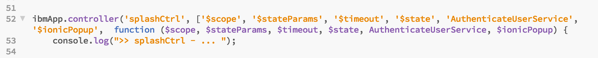
	
	**After**
	  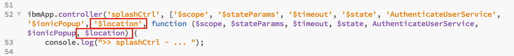
	

3. Next search the **$scope.doLogin = function ()** delete entire function and replace it with the code below

		/* using mfp challenge handler */    
    		$scope.doLogin = function () {
            console.log(">> loginCtrl - doLogin - $scope.user:" + $scope.user);            
            if ($scope.isChallenged){
                console.log(">> loginCtrl - doLogin -  $scope.isChallenged == true");            
                $scope.userLoginChallengeHandler.submitChallengeAnswer({
                    'username': $scope.user.username, 
                    'password': $scope.user.password
                });
            } else {
                console.log(">> loginCtrl - doLogin -  $scope.isChallenged == false");            
                WLAuthorizationManager.login("UserLogin",{
                    'username':$scope.user.username, 
                    'password':$scope.user.password
                }).then( function () {
                    console.log(">> WLAuthorizationManager.login - onSuccess");
                    $state.transitionTo("main");                        
                },
                function (response) {
                    console.log(">> WLAuthorizationManager.login - onFailure: " + JSON.stringify(response));
                    $scope.showLoginError();
                });
            }               
	    }  
	    		
	> Note: that in our scanrio we want to login a user **without any challenge being received.** showing a login screen as the first screen of the application, or showing a login screen after a logout, or a login failure. We call those scenarios **preemptive logins**.

	> You cannot call the submitChallengeAnswer API if there is no challenge to answer. For those scenarios, the MobileFirst Platform Foundation SDK includes the login API: 	**WLAuthorizationManager.login()**, If the credentials are wrong, the security check will send back a challenge.
	
	> It is the developer's responsibility to know when to use login vs submitChallengeAnswer based on the application's needs. One way to achieve this is to define a boolean flag, for example isChallenged, and set it to true when reaching handleChallenge or set it to false in any other cases (failure, success, initializing, etc).
	When the user clicks the Login button, you can dynamically choose which API to use:

4. Add the code below right after the "$soope.doLogin" code block ends.
> Note: the code below handle the challenge that return by the server when the application tries to acces protected resource or when it tries to get access token.

	
			$scope.isChallenged = false;
		    $scope.securityCheckName = 'UserLogin';    
		    $scope.userLoginChallengeHandler = null;
    
		    $scope.registerChallengeHandler = function(){        
	        console.log(">> in $scope.registerChllangeHandler ... ");
	        $scope.userLoginChallengeHandler = WL.Client.SecurityCheckChallengeHandler($scope.securityCheckName);    
	        $scope.userLoginChallengeHandler.securityCheckName = $scope.securityCheckName;    
	        
	        $scope.userLoginChallengeHandler.handleChallenge = function(challenge) {
	            console.log(">> in UserLoginChallengeHandler - userLoginChallengeHandler.handleChallenge ...");
	            //show the login ...                     
	            $scope.user = { username: "", password: ""};            
	            $scope.currentPath = $location.path();
	            console.log(">> $location.path(): " + $location.path());
	            $state.transitionTo("splash");            
	            $scope.isChallenged = true;
	            var statusMsg = "Remaining Attempts: " + challenge.remainingAttempts;
	            if (challenge.errorMsg !== null){
	                statusMsg = statusMsg + " " + challenge.errorMsg;                
	                $timeout(function(){   
	                    //want to show only when submit user/pass not when token expired ...
	                    if($scope.currentPath == "/"){
	                        $scope.showLoginError(statusMsg);    
	                    }                    
	                 }, 300);        
	            }
	            console.log(">>> statusMsg : " + statusMsg);
	        };
	
	        $scope.userLoginChallengeHandler.handleChallenge = function(data) {                
	            console.log(">> in UserLoginChallengeHandler - userLoginChallengeHandler.processSuccess ...");        
	            $scope.isChallenged = false;     
	            $timeout(function(){        
	                    $scope.user = { username: "", password: ""};
	            }, 200);                    
	            $state.transitionTo("main");                
	        };
	               
	        $scope.userLoginChallengeHandler.handleFailure = function(error) {
	            console.log(">> in UserLoginChallengeHandler - userLoginChallengeHandler.handleFailure ...");
	            console.log(">> handleFailure: " + error.failure);
	            $scope.isChallenged = false;
	            if (error.failure !== null){
	                alert(error.failure);
	            } else {
	                alert("Failed to login.");
	            }
	        };
	    }

	> Note: A **challengeHandler** is responsible for handling challenges sent by the MobileFirst server, such as displaying a login screen, collecting credentials and submitting them back to the security check. we use the **WL.Client.createWLChallengeHandler()** API method to create and register a challenge Handler, In order for the challenge handler to listen for the right challenges, you must tell the framework to associate the challenge handler with a specific security check name.
This is done by creating the challenge handler with the security check like this:
**someChallengeHandler = WL.Client.createWLChallengeHandler("the-securityCheck-name");**
	
	> Note: The minimum requirement from the WLChallengeHandler protocol is to implement the handleChallenge() method, that is responsible for asking the user to provide the credentials. The handleChallenge method receives the challenge as a JSON Object.
	
	> Note: Once the credentials have been collected from the UI, use WLChallengeHandler's **submitChallengeAnswer()** to send an answer back to the security check.
	
	> Note: **Handling failures** Some scenarios may trigger a failure (such as maximum attempts reached). To handle these, implement WLChallengeHandler's **handleFailure()**

	> Note: **Handling successes** In general successes are automatically processed by the framework to allow the rest of the application to continue, Optionally you can also choose to do something before the framework closes the challenge handler flow, by implementing WLChallengeHandler's **processSuccess()**. Here again, the content and structure of the success JSON object depends on what the security check sends.
	
	
5. Let's also modify the **showLoginError** method so we can display the error messages that are been returned from the server, replace the **showLoginError** with the code below

		//show alert login error ... 
	    $scope.showLoginError = function(msg) {
	        if(msg == null || msg == undefined) msg = 'Please check your username and password and try again';
	        var alertPopup = $ionicPopup.alert({
	            title: 'Login Error!',
	            template: msg
	        });
	        alertPopup.then(function(res) {
	            console.log('>> Thank you for trying ...');
	        });
   		};

	**Before**

	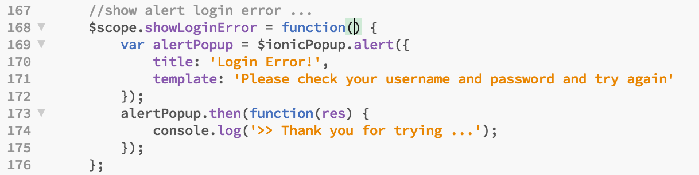

	**After**
	
	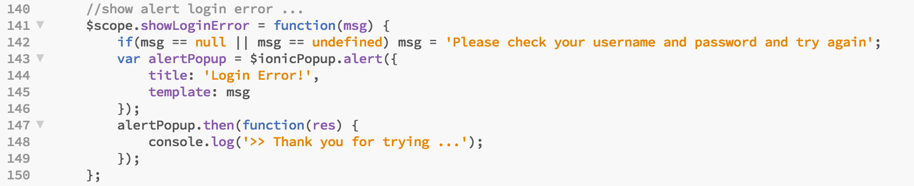

6. Next add a call to register our challengeHandler navigate to the bottom of the page and add the following code below just before the **},3000);**
	
		$scope.registerChallengeHandler();

	
 **Before**

 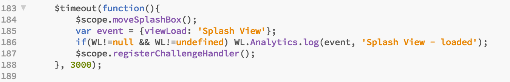

 **After**

 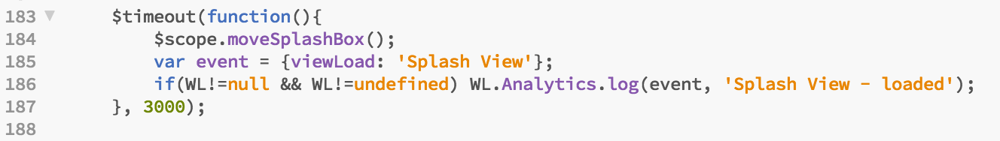

 **You new code should like this below**
	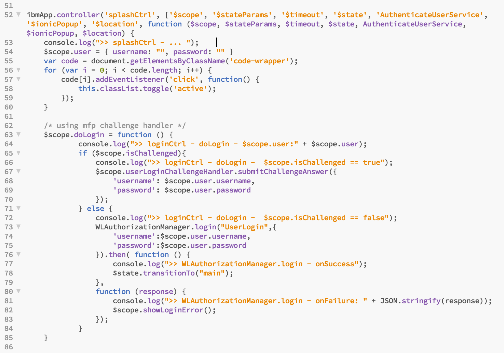
	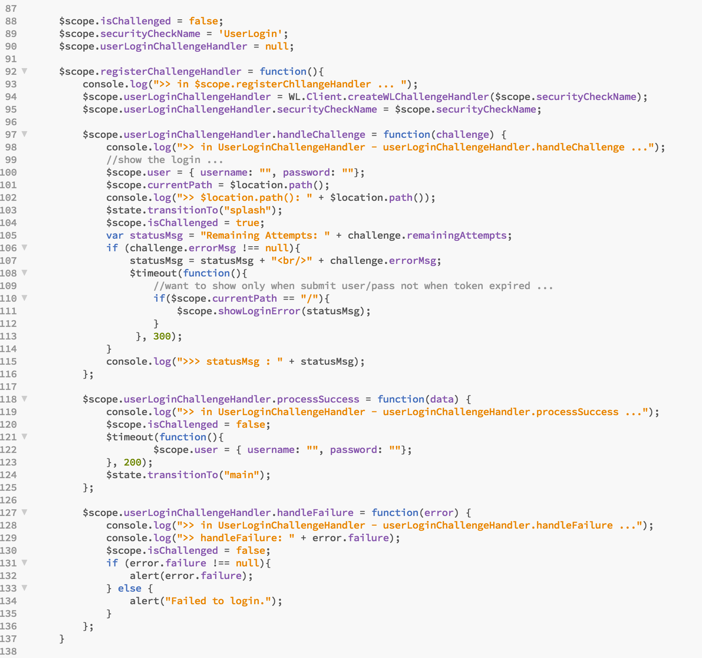
	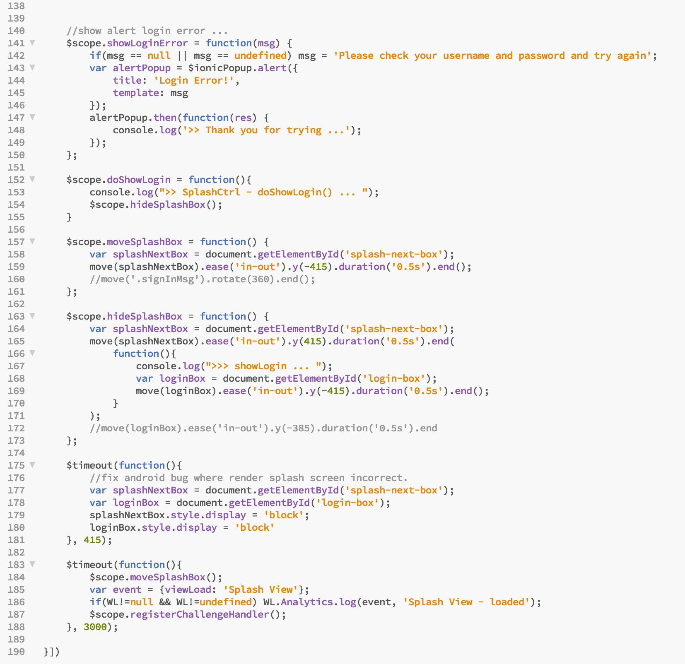

	
7. Next let's change the logout method, locate the **ibmApp.controller('appCtrl'** and replace the **$scope.logout** function with the code below :
	
		$scope.logout = function() {
	        console.log(">> in appCtrl - logout");
	        $timeout(function(){        
	                    $scope.user = { username: "", password: ""};
	        }, 200);                
	        WLAuthorizationManager.logout("UserLogin").then(
	            function () {
	                console.log(">> logout onSuccess");
	                $state.transitionTo("splash");  
	            },
	            function (response) {
	                console.log(">> logout onFailure: " + JSON.stringify(response));
	                $state.transitionTo("splash");  
	            });
        }    

	> Note : The MobileFirst Platform Foundation SDK provides a logout API to logout from a specific security check.
	
	**Before**
	
	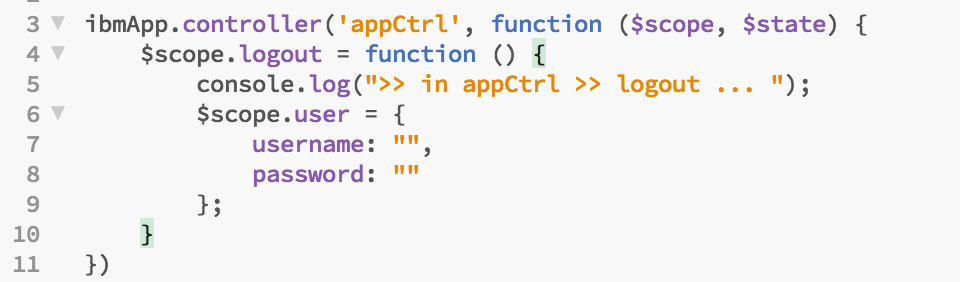

	**After**

	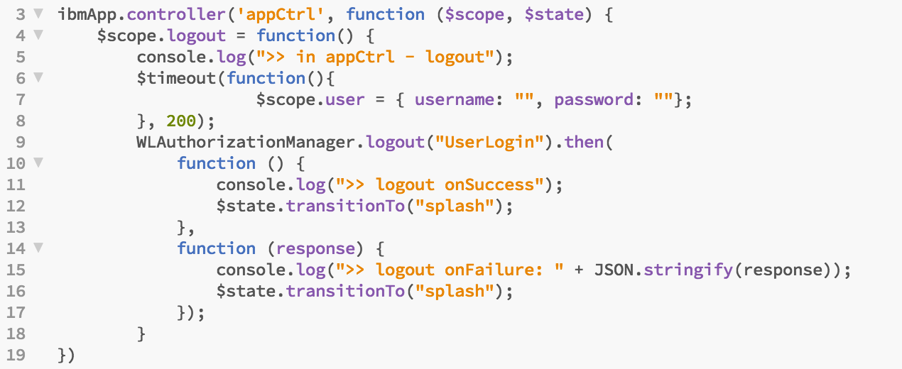

	
8. **Save** your changes.

###Test the client side application

1. Run the application by running
	
		cordova prepare
		cordova emulate
	
2. 	Use any combination of matching username and password to login for example demo/demo, you will see the employee list below.

	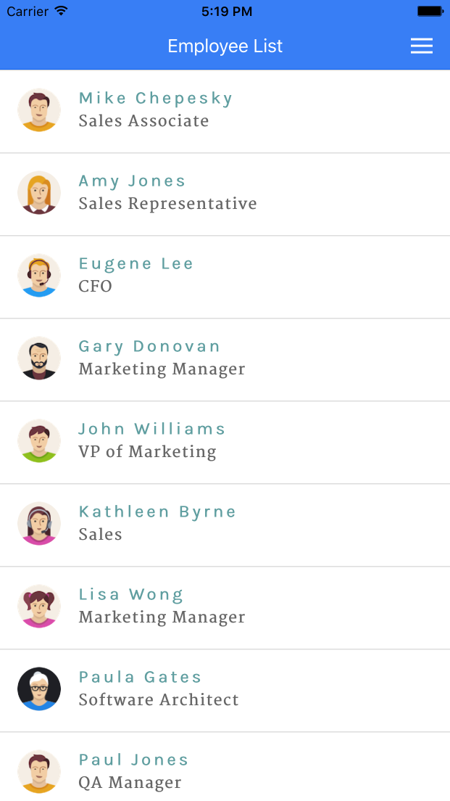

	
3. By default the application timeout is 60 seconds, lets open the web console and change the "How long the successful sate valid for (seconds)" to 10 seconds.

4. Select the **UserLogin** adapter under the adapter list on the left side menu.

	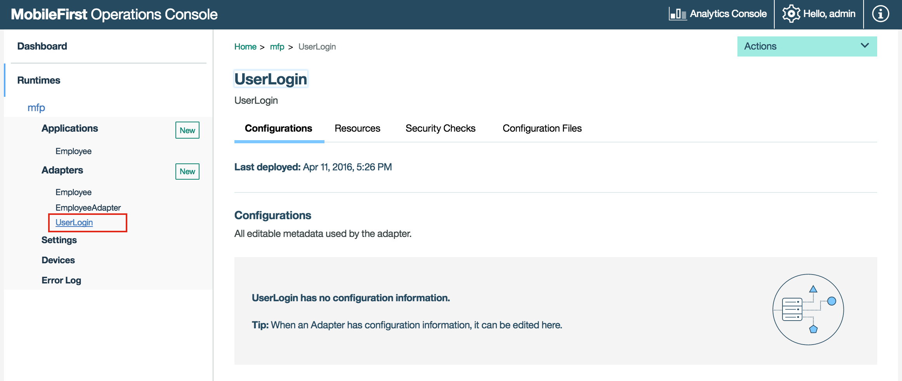

5. Select the *SecurityChecks* tabs.

	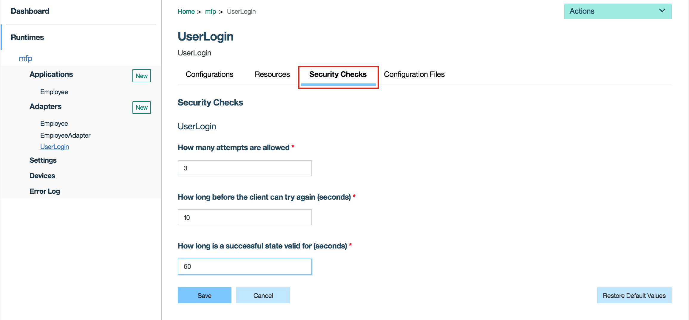

6. Change the value to 10 seconds and press the "Save" button.

	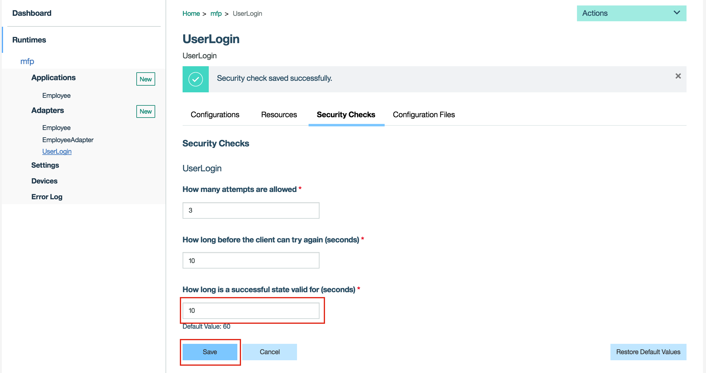

7. Go back the the device emulator and press on one of the employees.

	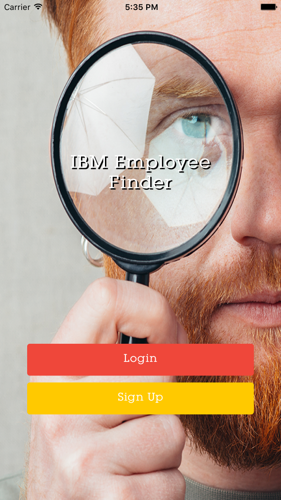

	> Note: The application log you out automatically since the token is not valid any more.
	
8. 	**Login** again but this time use un-matching values for the username and password and let's take a look at the error message that we got.

	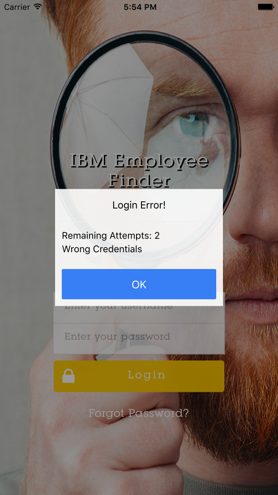	
	> Note: This is the error message we that was returned by the server, you can change the number of attempts and the error message by updating the UserLogin security check, or change the the attempts using the MFP web console.

### Summary
You In this lab, you used the used the preemptive logins concept which is classic solution for scenarios where showing a login screen as the first screen of the application, or showing a login screen after a logout, or a login failure. you used the **WLAuthorizationManager.login()** API method to login the user without any challenge being received, you also use the Use the **WL.Client.createWLChallengeHandler()** API method to create and register a challenge Handler.

### In case you got lost on the way

You can easily get to this stage by running the following command :

     git checkout -f step-11

