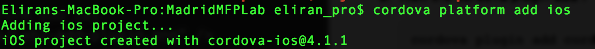
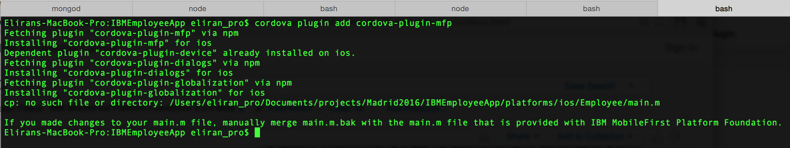
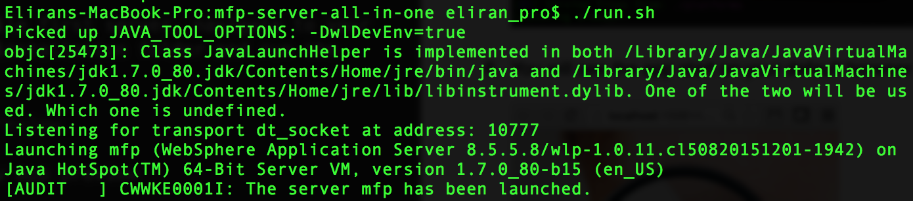
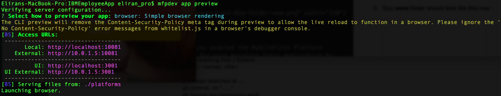
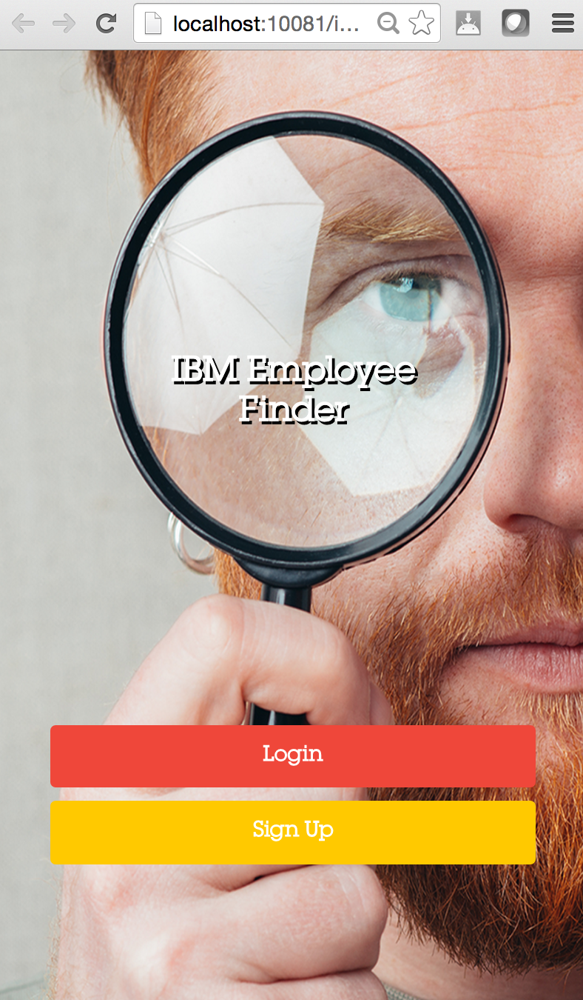

- - -
# Lab 2 - The Cordova CLI & MFP v8.0 Cordova Plugin

This lab will use the Cordova CLI to add the MobileFirst Cordova plugin. These are the standard steps required to add plugins to an application. Adding the MobileFirst plugin allows the application to use the MobileFirst platform features. 

**General Steps:**

1. Within the IBM Employee application directory, run Cordova CLI command to add a plugin.

1. Add one or more device platforms.

2. Use the MobileFirst CLI to preview the application to ensure the plugin was successfully added. 

##Steps

1. Change context into the MobileFirst project.

        cd IBMEmployeeApp        

2. **Add** the iOS platform, run the following command cordova platform add ios

	```
cordova platform add ios
```
	

3. **Run** the cordova plugin add cordova-plugin-mfp

        cordova plugin add cordova-plugin-mfp
     

	>Note:  To be able to easily debug your application and view your application console log, run the following command to add the cordova console plugin 
	
		 cordova plugin add cordova-plugin-console

4. **Start** the mobile first server, navigate to your mobile first server installation folder and run the following command

	> **Note:** Running the add plugin command above will add all the required MFP plugin files from npm. This requires a network connection. For more information on the MFP Cordova Plugin, visit: [https://www.npmjs.com/package/cordova-plugin-mfp](https://www.npmjs.com/package/cordova-plugin-mfp)

4. **Start** the mobile first server, navigate to the mobile first server installation folder and run the following commands:

	*For Mac*
	- Open a new terminal session

		```
cd ~/MobileFirst-8.0.0.0
```

		```
./run.sh
```
		
		
  
5. **Run** the mfpdev app preview

        mfpdev app preview

  

6.  The preview will prompt for using either the simple browser or the mobile browser simulator. Select the simple browser. This will launch the  application using the default browser.

	```
Verifying server configuration...
? Select how to preview your app: (Use arrow keys)
❯ browser: Simple browser rendering 
  mbs: Mobile Browser Simulator 
```

  

> **Tip:** To change the default browser use the `mfpdev config` command.
 

##Summary
This lab enabled the MobileFirst Platform functionality for an existing Ionic/Cordova application by simply issuing the Cordova plugin add command. 

If you were unable to complete this lab, you can catch up by running this command: ** **You will still need to add the iOS platform and the mfp cordova plugin manually since the plugin folder is not committed to the git repo**

```
git checkout -f step-2
```