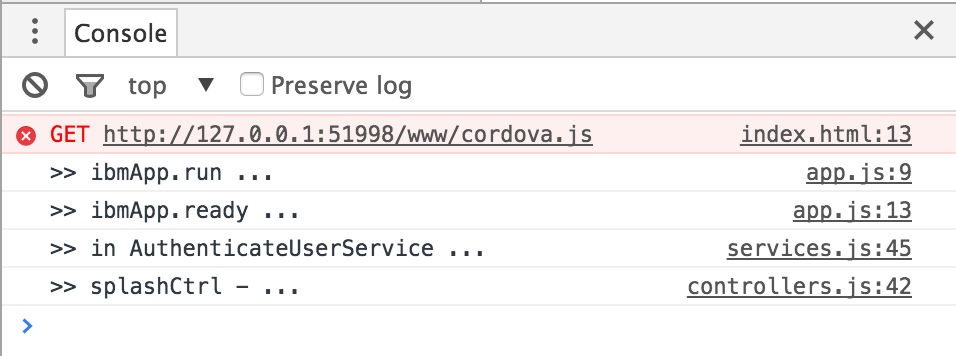
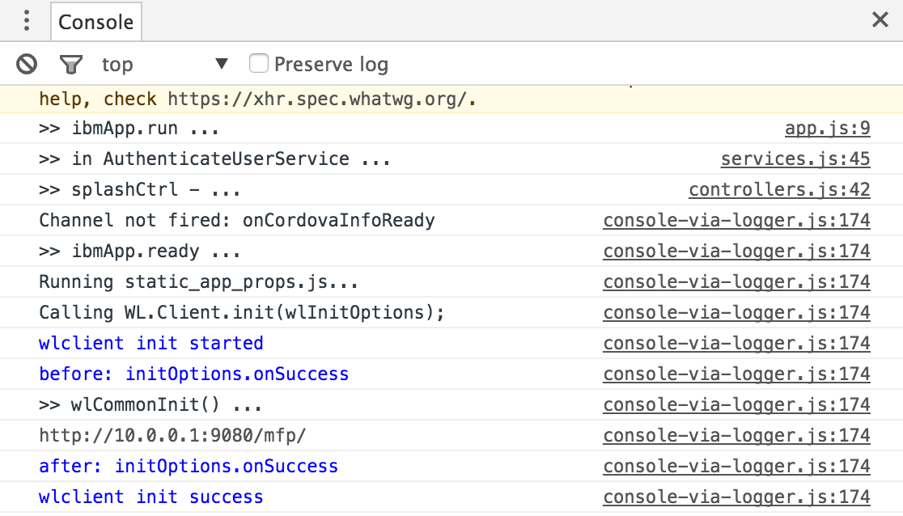

- - -
# Lab 3 - Load MFP framework and application Bootstrapping

At this point, you have a MobileFirst Cordova application project, with Ionic-built application logic.  To enable the basic MobileFirst capabilities we will need to add few pieces of code.  

In this lab, you will add this MFP JavaScript code to the Ionic application source and bring up the new application in an emulator.  
We are going to use the Mobile Browser Simulator (MBS) , one of the components provided with the MobileFirst.  MBS can also be used to preview the application.  In contrast to the `cordova emulate` command, the `mfpdev app preview` command does not require a platform emulator (such as Android Virtual Device) - it operates entirely in the browser.  The simulator also enables you to leverage browser developer tools such as the debugger, style editor and inspector.

The Mobile Browser Simulator requires a MobileFirst development server to operate.  

>Note:  For this lab there are snippets files included in the **/snippets** folder of your workspace which can be used to quickly copy/paste the large source code blocks below.

##Steps

1.  Open the **IBMEmployeeApp** project using your favorite IDE. You are going to copy some code from `snippets/lab3.js` file to the `app.js` file in your MobileFirst project.

  > Note:  You may use any IDE you like to perform the labs.  The examples shown use the Brackets IDE.

2. Open the **`app.js`** file in the folder **`IBMEmployeeApp/www/js`** and add the following code immediately after the declaration of ibmApp and just after the *"//Add support for Cordova"* and before the comment *"//application config"*:

  


   ``` javascript
  
     //Adding support for cordova.
         ibmApp.run(function($ionicPlatform) {
               console.log('>> ibmApp.run ...');
               $ionicPlatform.ready(function() {
                 // Hide the accessory bar by default (remove this to show the accessory bar above the keyboard
                 // for form inputs)
                 console.log('>> ibmApp.ready ...');
                 if (window.cordova && 
                     window.cordova.plugins && 
                     window.cordova.plugins.Keyboard) {
         			    cordova.plugins.Keyboard.hideKeyboardAccessoryBar(true);
                 }
                 if(window.StatusBar) {
                   StatusBar.styleDefault();
                 }
               });
             });

   ```
  

3. Within **`app.js`** scroll to the very bottom of the file and add the following code just after the *"// Add MobileFirst configuration stuff."* comment (locate snippet for copy/paste in the **/snippets** folder):


   ``` javascript

   // Add MobileFirst configuration stuff.
	 var Messages = {
		   // Add here your messages for the default language.
		   // Generate a similar file with a language suffix containing the translated messages.
		   // key1 : message1,
	};

	var wlInitOptions = {
		   // Options to initialize with the WL.Client object.
		   // For initialization options please refer to IBM MobileFirst Platform Foundation Knowledge Center.
	};

	function wlCommonInit() {
		   console.log(">> wlCommonInit() ..." );  
		   var serverUrl = WL.App.getServerUrl(function(success){
		       console.log(success);
		   }, function(fail){
		       console.log(fail);
		   })
	}
	
   
   ```


  

4. **Save** the app.js file 

	### Preview the application
	
	
	There are two options available to preview the application :
	
	- Use the **cordova emulate** command 
	  - The emulate command launches an android virtual device or Xcode iOS simulator       
	- Use the **mfpdev app preview** command.  
	  - The preview command provides options of: 
	       - Simple browser rendering or 
	       - Mobile Browser Simulator rendering
	
	The **mfpdev cordova preview** command provides easy preview, testing, and debugging of applications using the embedded browser debugger. The Mobile Browser Simulator feature also supports many Cordova device emulation controls for items such as GPS and accelerometer.  However, this requires that the MobileFirst server will be running, make sure you start the MFP server using the ./run.sh command
	
	We going to preview the application using the **mfpdev app preview** first.


5. **Run** the application in the browser we can run the application using the *lighting* button within Brackets or use the following command and select the first option **browser: Simple browser rendering** 

	~~~~~~~~~~~~~~~~~~~~~~~~~~~~~~~~~~~~~~~~~~~~~~~~~~~~~~~~~~~~~~~~~~~~~~~~~~~~~~~~
 mfpdev app preview
~~~~~~~~~~~~~~~~~~~~~~~~~~~~~~~~~~~~~~~~~~~~~~~~~~~~~~~~~~~~~~~~~~~~~~~~~~~~~~~~

  > Note that when you select the **browser: Simple browser rendering** and take a look at the browser console log you will see that the WlCommonInit callback didn't called and also you don't see any indication that the WL SDK was loaded successfully, take a look at the image below

  

6. **Run** the application in the browser this time we going to use the **mbs: Mobile Browser Simulator** 

  > Note that when you select the **mbs: Mobile Browser Simulator** and take a look at the browser console log you will see that the WlCommonInit callback was called and we can see that the wlClient init started and the wlClient init success and we can see the printout of the MFP server url.


  

	> note that since MobileFirst platform is provided as a standard plugin you will not be able to continue testing/developing your application using the standard browser, you will need to use the Mobile Browser Simulator or device emulator instead.

7. Use the cordova emulate command which will allow you to choose between the platform you choose to add:
android or iOS.  
  > Note that iOS will only be available if you are working from a machine running OS X.  

        cordova emulate

  You can select a specific device.  since you didn't specify the device Cordova select on for you (List of available devices will depend on the type of host machine you are running on and which Android Virtual Devices are installed.)
  
  > Note: If you are running on the provided VM, you will only have the **Nexus\_5\_API\_22\_x86** device available.

  
  

8.  In a few moments, the application will start up in an ios emulator window.


      

3. Close the Emulator when finished.


##Summary
In this lab, you enabled the MobileFirst project to use the services provided by the platform by adding code to the main app.js file.  

If you were unable to complete this lab, you can catch up by running this command:

     git checkout -f step-3
     
