- - -
# Lab 4 - Register and Manage Application


The MobileFirst platform provides a web based console to easily view and manage application instances, platforms and versions.  Managing an application requires an application registration. Registering an application will also enable secure connectivity to the MobileFirst server and will enable the use of the adapter framework and analytics capabilities of the MFP server.

##Steps

1. Open the **IBMEmployeeApp** project using a preferred IDE. Code snippets are available from the `snippets/lab4.js` file.

1. Open the **`app.js`** file in the folder **`IBMEmployeeApp/www/js`** locate the **wlCommonInit()** function and add the following code immediately after the last line of the code inside

	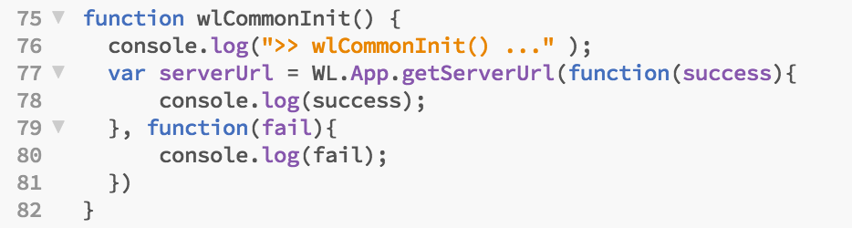


   ``` javascript
	//Calling to the MobileFirst Server    
	WLAuthorizationManager.obtainAccessToken().then(
	        function (accessToken) {
	          console.log(">> Success - Connected to MobileFirst Server");          
	        },
	        function (error) {
	          console.log(">> Failed to connect to MobileFirst Server");          
	        }
	);
```
  
  Your code should look like this:
  
    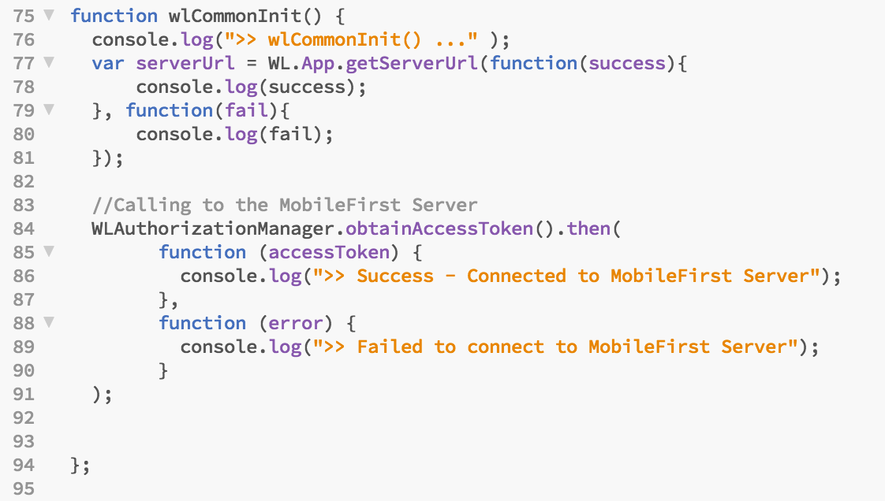
    
	> **Note:**  That the **`WLAuthorizationManager.obtainAccessToken()`** method the obtains an access token for the specified resource scope from the MobileFirst authorization server. The **WLAuthorizationManager** class is instantiated as a singleton and can be used anywhere in the application to obtain the client ID and authorization header. It is also called internally to handle MobileFirst OAuth-based security model protocol.
      
	> **Important:**  That **WLAuthorizationManager.obtainAccessToken()** method replaces the deprecated **WL.Client.connect()** method that has been used in earlier version of MFP to establishes a connection to the MobileFirst       
  
3. Next register the application with the MobileFirst Server, **Run** the following command 
	```
mfpdev app register
```

	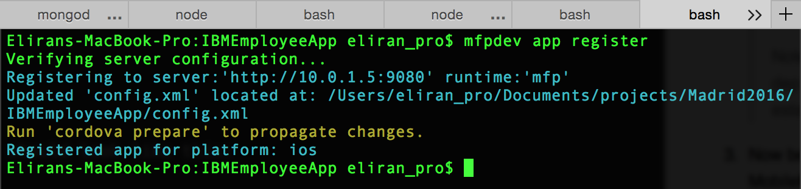
        
4. The Operations Console is a browser-based interface through which you can manage artifacts deployed to your server.  View the **Operations Console** by running
	```
mfpdev server console
```

	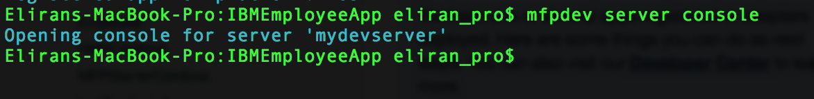

	The MobileFirst Operations Console will start in your default browser, you can see the application 'Employee' under the "Application" list on the  dashboard left side.

  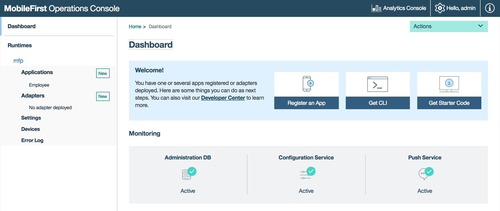

5. Use the cordova emulate command to preview the application on the emulator.
	```
cordova emulate
```

6. Check the console logs. While the iOS simulator is selected press the Simulator's debug menu and select the "Open console logs option" 

  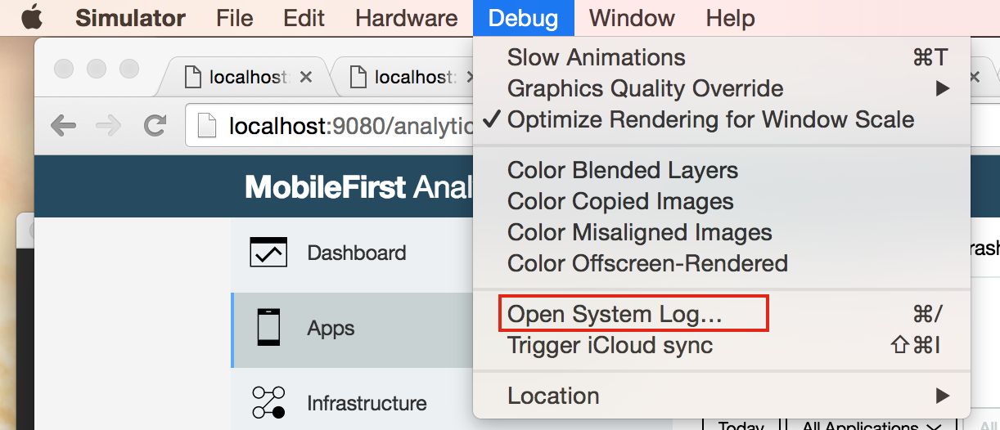


  Then in the search box on the top right corner enter ">>" you should be able to see the connection success message

  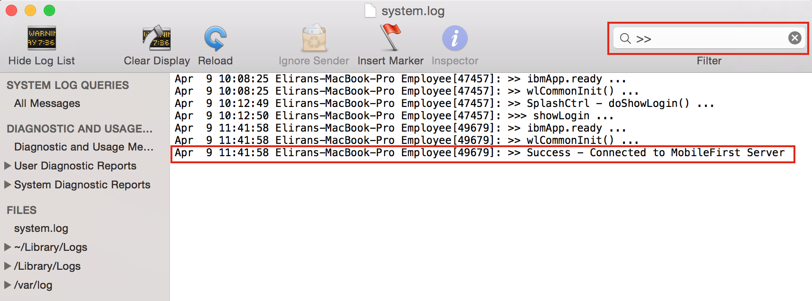
  
	Notice the application has successfully connected to the MFP server.
  
7. Delete the ">>" and enter "Response Content" you will see that the server responded with "access_token"

	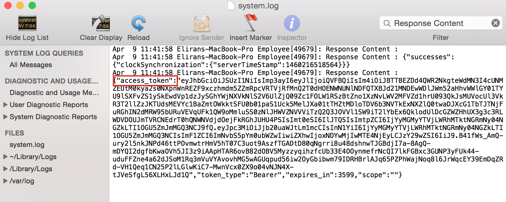

8. Close the simulator and go back to the web console, lets take a look at the built-in management capabilities of the platform, you can also enter the following url in your browser  **http://localhost:9080/mfpconsole/index.html#/dashboard**

9. **Press** on the "Employee" application under the "Application" menu on the left side, you will see the Employee Management feature.

  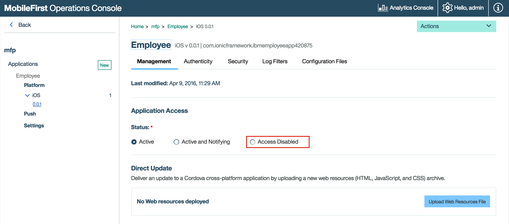
  

10. **Select** "Access Disable" option

11. In the "URL of latest version" input filed simply enter "http://www.cnn.com"

12. In the "Default notification message*" enter "Application disabled, please download latest version"
	  
	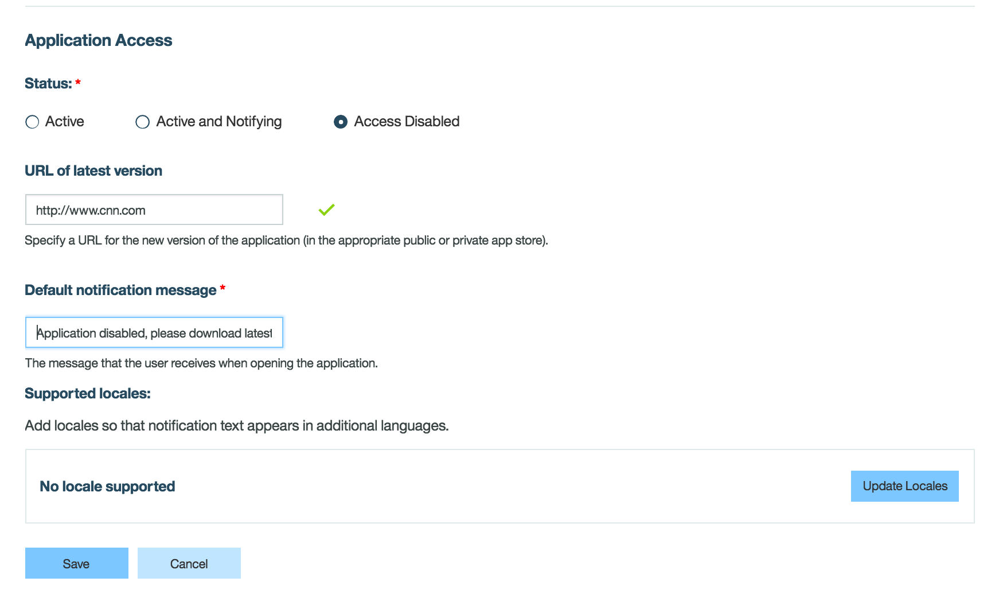	

13. Press the "Save button"

	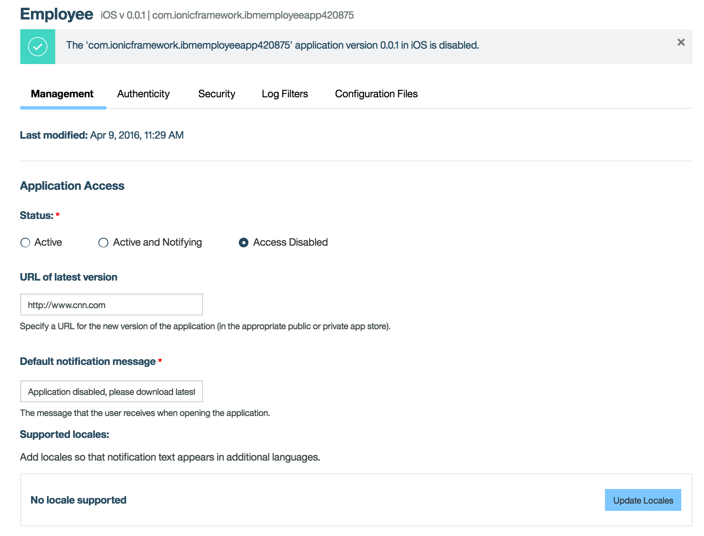


14. **Run** the application again using the cordova emulate command
	```
cordova emulate
```

	**Notice** the "Access disabled" notification when the application starts.

	  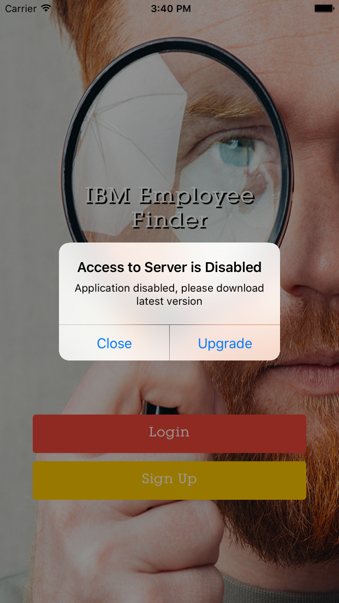

15. **Press** the "Upgrade" button, you will see the browser on your phone open the cnn.com website.
		
	  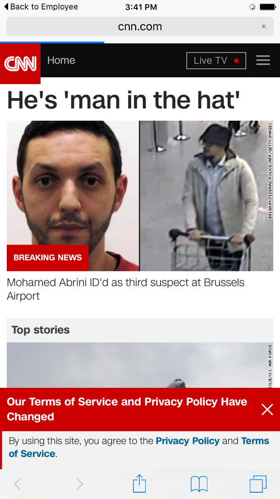
	
  
##Summary
In this lab, you added javascript code to connect to the MobileFirst server when the application start, and used the built-in management features of the platform.

If you were unable to complete this lab, you can catch up by running this command:

     git checkout -f step-4