- - -
# Lab 5 - Implement the MFP adapter framework (Server Side)

If you have looked at the code in app.js in detail, you have noticed that the app is currently using the Employee service and Employee Details controllers.  These services use angular $http services to get the application data, which is stored in .json files locally on the device.  In the next section, you will create MFP adapters to get data from back-end services.  MFP Adapters provide a way to retrieve and manage data for your mobile client app on the server side.

The MobileFirst Adapter framework provides support for developing adapters in Java or JavaScript to interface with various back-end architectures such as HTTP, SQL and SAP among others.  The Adapter framework also automatically couples with the MFP security and analytics frameworks, enabling consistent security to back-end resources and ability to record, measure and compare the operational characteristics of the adapter traffic - volumes, servers, response times, etc...

For our lab, we will build a Java adapter to interact with a REST API provided by BlueMix service StrongLoop/API Connect (Node.js appliction) available using the follow url: [http://employeenodeapp.mybluemix.net/](http://employeenodeapp.mybluemix.net/)


We are provided two REST end points **employees** and **details**.  The **employees** end point takes no parameters and returns a JSON-formatted string of employees (our employee "list"), and **details** takes an employee ID parameter and returns the details for that employee.  

Using imagination, the **REST Api** could be an REST APi provided by your organization which allow you to access your system of records.  
The adapter framework allows you to easily adapt to changes in backend data formats or even completely replace with a different data source, without affecting the client app running on (dozens, hundreds, thousands or millions of) mobile devices.   Changes in your back-end can be addressed in the adapter tier without forcing you to rebuild and redistribute the client app.


>Note:  For this lab there are snippets files included in the **/snippets** folder of your workspace which can be used to quickly copy/paste the large source code changes in the lab steps below.

>Note:  Please make sure you have **Apache Maven** installed, and you add it to your path, you can confirm by running **mvn -v** in the terminal 

   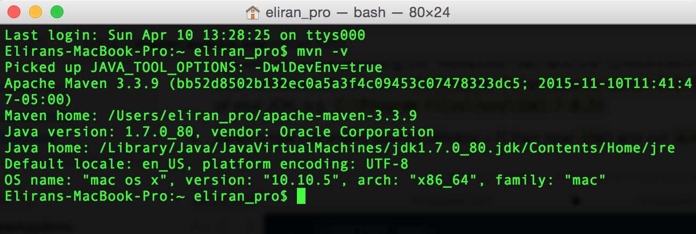


##Steps
### Create the adapter

>Note:  In previous versions of MFP, you had to create BackEnd project first, before you coul'd create an adapter, Starting v8.0 you don't need to create a back-end project in order to create an adapter.

1. Create new folder called AdapterServices in paralel to your IBMEmployeeApp folder

        cd ..
        mkdir AdapterServices

2. Change context to AdapterServices

        cd AdapterServices
        
   
2. **Create** a Java-based adapter to your project

        mfpdeve adapter create

   1. When prompted, name your adapter **`EmployeeAdapter`**
   
   2. For adapter type select : **`Java`**
   
        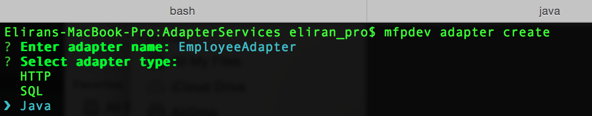
   
   
   3. For Java package enter : **`com.ibm`** and press **`Enter`**.  You should get the following success message:
           

   4. For group ID enter : **`com.ibm`** and press **`Enter`**.  You should get the following success message:

		

	3. Looking at your file directory you should see the following structure/files

	   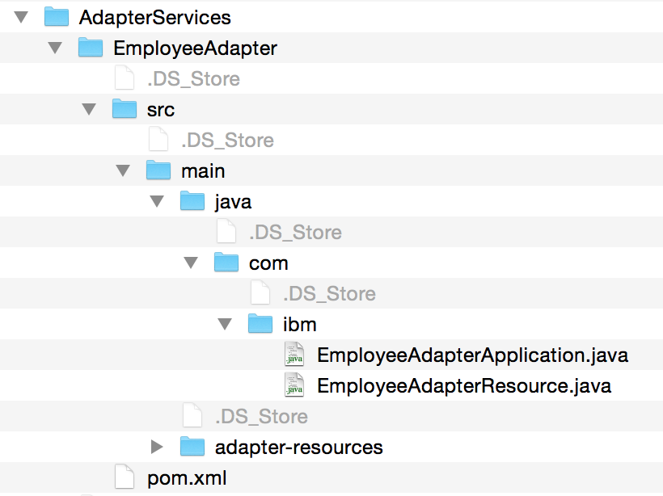

   
### Implement the adapter procedures
The Java adapter implements the JAX-RS standard, allowing your adapter to also serve as a REST-ful endpoint.  The procedures in the adapter are linked to HTTP verbs such as GET and POST.  The adapter is created with sample procedures, which you can remove.  In the next several steps, you will add code to implement two new methods:

- **list()**
- **details()**
      
1. Using your favorite IDE open the **EmployeeAdapterResource.java** file in the **EmployeeAdapter/src/main/java/com/ibm** directory.

3. Find the **ConfigurationAPI configApi;** statement around line 49 and remove all of the methods from the class.  Your adapter should look like this:
   
   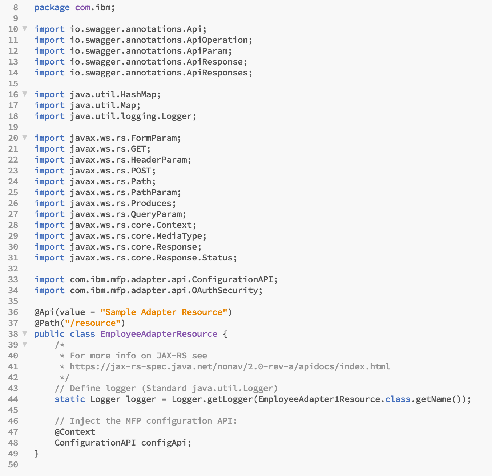
      
4. Modify the Path statement to root the adapter REST path at **`/services`** rather than `/resources`.

    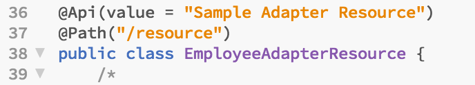
    
5. Add the **employees** method just before the final curly brace.  This method implements the REST operation "/list", returning a list of all employees by calling **getHttp()** method with our back-end REST end point, we going to implement the **getHttp()** in the next few steps.
   
   ``` java
/*
	 * Path for method:
	 * "<server address>/mfp/api/adapters/EmployeeAdapter/services/list"
	 */
@ApiOperation(value = "Get employee list", notes = "Return employee list")
	@ApiResponses(value = { @ApiResponse(code = 200, message = "A constant string is returned") })
	@GET
	@Path("/list")
	@Produces(MediaType.TEXT_PLAIN)
	@OAuthSecurity(enabled = false)
	public String employees() {
		System.out.println(">> in employees() ...");
		logger.info(">> EmployeeAdapterResource: employees");
		String rsp = null;
		try {
			rsp =  getHttp("http://employeenodeapp.mybluemix.net/employees");
		} catch (ClientProtocolException e) {
			// TODO Auto-generated catch block
			e.printStackTrace();
		} catch (IOException e) {
			// TODO Auto-generated catch block
			e.printStackTrace();
		}
		return rsp;
	}   
   ```
   
    
6. Add the **getDetails** method just before the final curly brace.  This method implements the REST operation "/details/{id}", returning the details of a given employee by calling into **getHttp()** method with the supplied employee id.
  
   ``` java
/*
	 * Path for method:
	 * "<server address>/mfp/api/adapters/EmployeeAdapter/services/details/{id}"
	 */

	@ApiOperation(value = "Employee Details by Id", notes = "Return the employee detials, by Id")
	@ApiResponses(value = {
			@ApiResponse(code = 200, message = "Property value returned."),
			@ApiResponse(code = 404, message = "Property value not found.") })
	@GET
	@Path("/details/{id}")
	@Produces(MediaType.TEXT_PLAIN)
	public String getDetails(
			@ApiParam(value = "The name of the property to lookup", required = true) @PathParam("id") String id) {
		// Get the value of the property:
		System.out.println(">> in getDetails() ...");
		System.out.println(">> id :[" + id + "]");
		String rsp = null;
		try {
			rsp =  getHttp("http://employeenodeapp.mybluemix.net/details?id=" + id);
		} catch (ClientProtocolException e) {
			// TODO Auto-generated catch block
			e.printStackTrace();
		} catch (IOException e) {
			// TODO Auto-generated catch block
			e.printStackTrace();
		}
		return rsp;

	}
   ```
6. Add the **getHttp()** method just before the final curly brace.  This method implements the REST http calls to our back-end and will be used internally by operation "/details/{id}" and "/list".
  
   ``` java
private final String USER_AGENT = "Mozilla/5.0";	
	public String getHttp(String url) throws ClientProtocolException, IOException{
		HttpClient client = HttpClientBuilder.create().build();
		HttpGet request = new HttpGet(url);
		// add request header
		request.addHeader("User-Agent", USER_AGENT);
		HttpResponse response = client.execute(request);
		System.out.println("Response Code : " 
	                + response.getStatusLine().getStatusCode());

		BufferedReader rd = new BufferedReader(
			new InputStreamReader(response.getEntity().getContent()));

		StringBuffer result = new StringBuffer();
		String line = "";
		while ((line = rd.readLine()) != null) {
			result.append(line);
		}		
		return result.toString();
	}	
   ```


5. Add the import statement for our backend jar file after the other imports

   ``` java
	/* Add org.apach.http*/
	import org.apache.http.HttpResponse;
	import org.apache.http.client.ClientProtocolException;
	import org.apache.http.client.HttpClient;
	import org.apache.http.client.methods.HttpGet;
	import org.apache.http.impl.client.HttpClientBuilder;
	import java.io.BufferedReader;
	import java.io.IOException;
	import java.io.InputStreamReader;
   ```
 
  
8. **Save** your changes.
 
  Your adapter code should be like this now:

  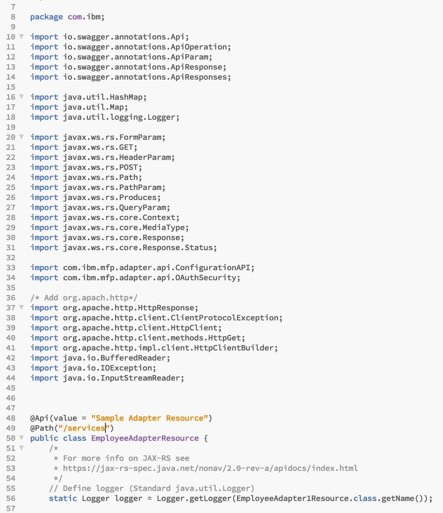
  
  
  

  
  
### Test your adapter
The MFP CLI provides the ability to test adapters using command line commands.  This is not only helpful for manually testing your adapters during development, but it can be leveraged by automated test scripts as part of your DevOps process automation strategy.

1. To test your adapter using the MFP CLI, you must first build it and deploy it to the MFP Development server.
   
        mfpdev adapter deploy
   
   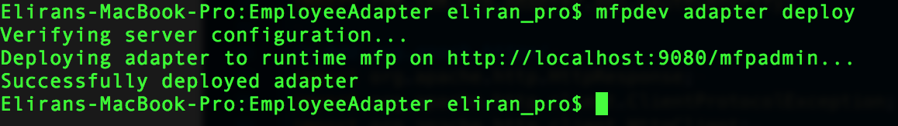
  
   > **Note:** If you encounter compilation errors, you will need to correct them before moving forward.  You can get compilation error listings by using the -d switch on the push command:
   
        mfpdev adapter deploy -d
  > Evaluate the results, edit your code and continue to push until your errors have been resolved.
   
2. Once your adapter builds correctly, open the **Operational Console**.  You should see that your EmployeeServices adapter has been deployed

        mfpdev server console 

   

3. Close the **browser**.
4. Test the **list** procedure using the CLI

        mfpdev adapter call 
        
   Use your keyboard arrow keys to highlight the adapter **EmployeeAdapter** and then press **Enter**.  Then usse your keyboard arrow keys to highlight the endpoint **get:/EmployeeAdapter/services/list** and then press **Enter**.  The adapter response object will be printed in the console:

   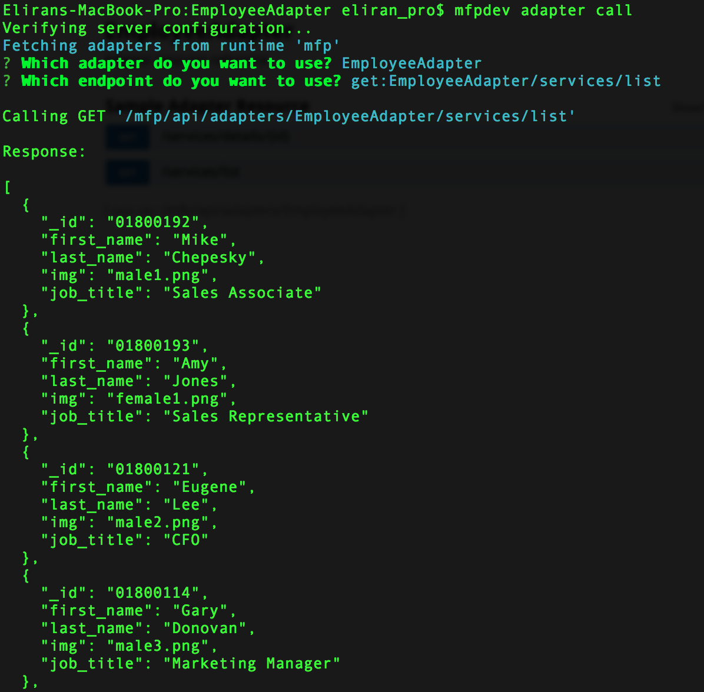

5. Test the **details** procedure using the CLI

        mfpdev adapter call 
        
      Use your keyboard arrow keys to highlight the adapter **EmployeeAdapter** and then press **Enter**.  Then usse your keyboard arrow keys to highlight the endpoint **get:/EmployeeAdapter/services/details/{id}** and then press **Enter**.  The adapter response object will be printed in the console:

   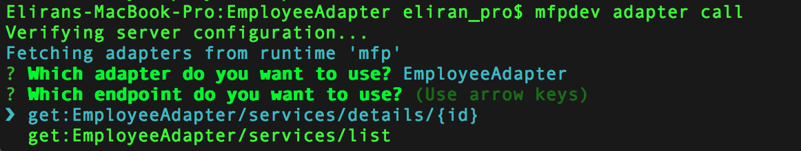

   When prompted for the path parameters, enter **`/services/details/01800292`**, then press **`Enter`**.  This will retrieve the details record for employee Amy Jones.

   The adapter response object will be printed in the console:
   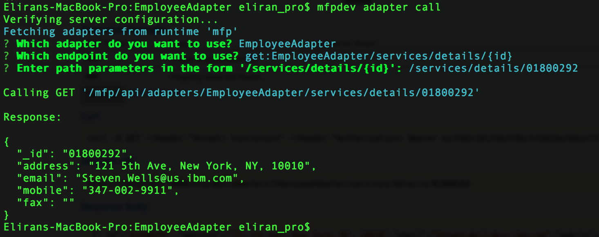
  
## Summary
In this lab, you added a Java-based MobileFirst adapter to your project.  You then edited the code to implement two procedures that will return a list of employees and employee details via REST interface calls from your mobile client.  You then used the MFP CLI to invoke your adapter procedures manually to confirm they work as expected.

>Note:  You can also test your adapters by using the built-in Swagger interface available through the console.

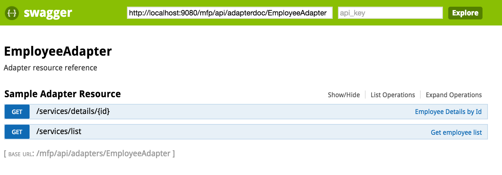

If you were unable to complete this lab, you can catch up by running this command:

     git checkout -f step-5

