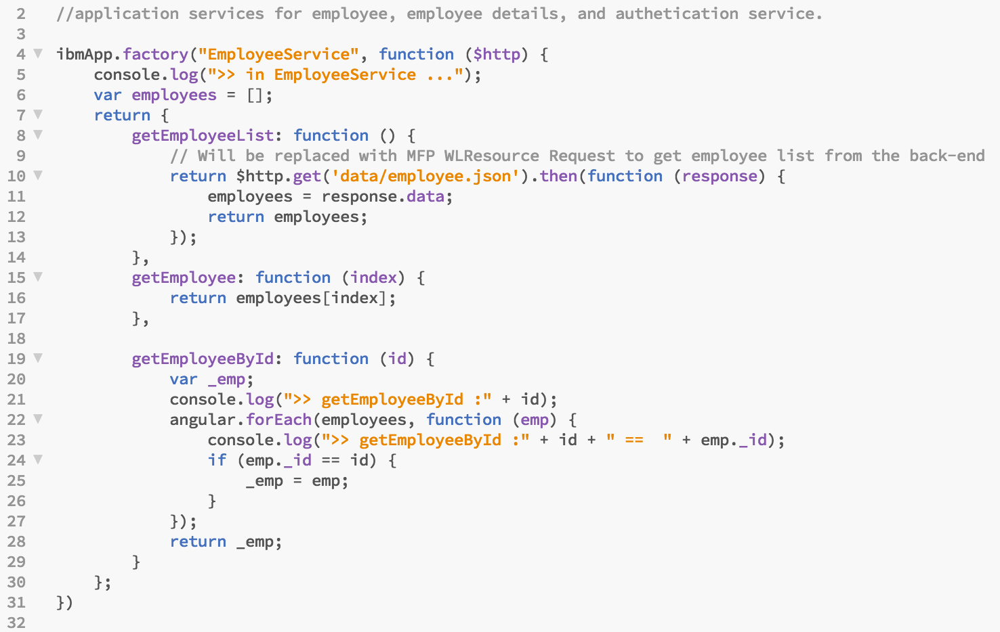
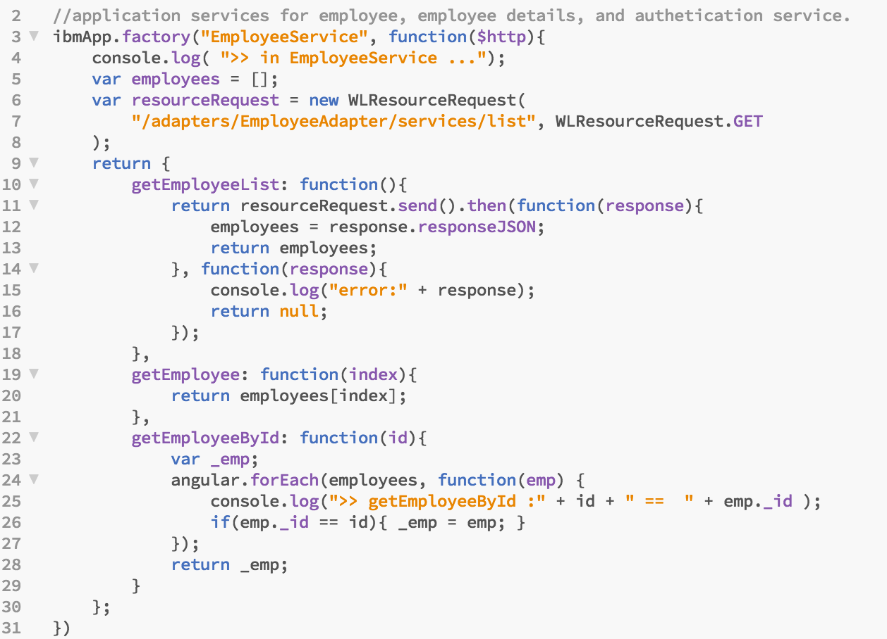
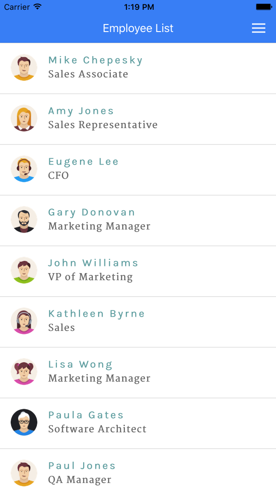
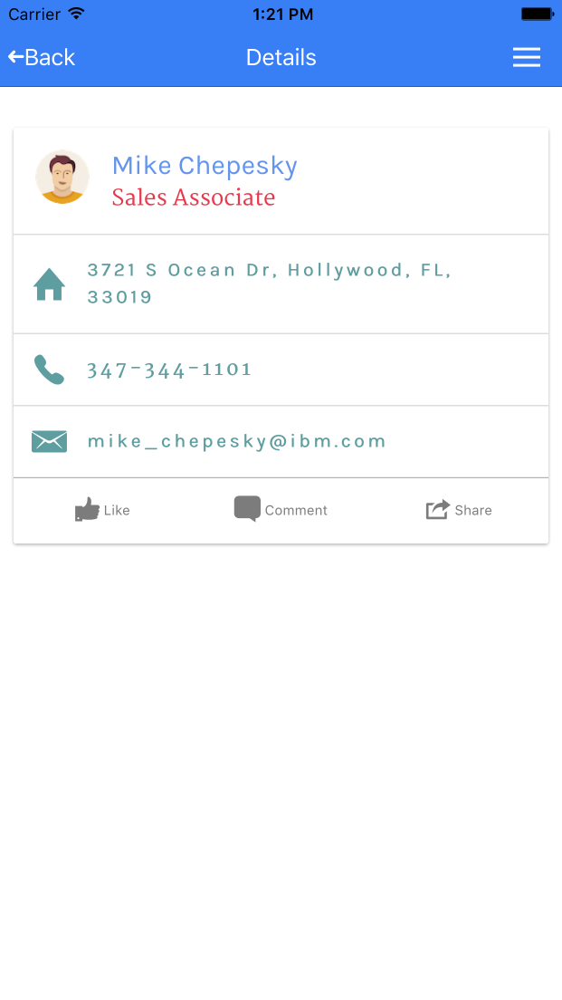
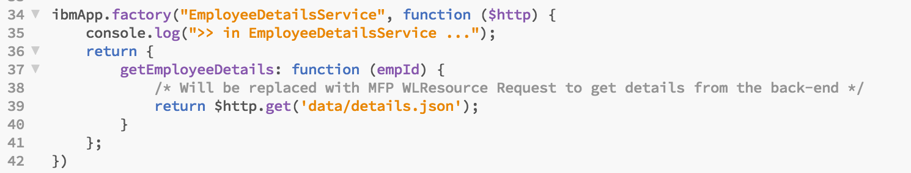
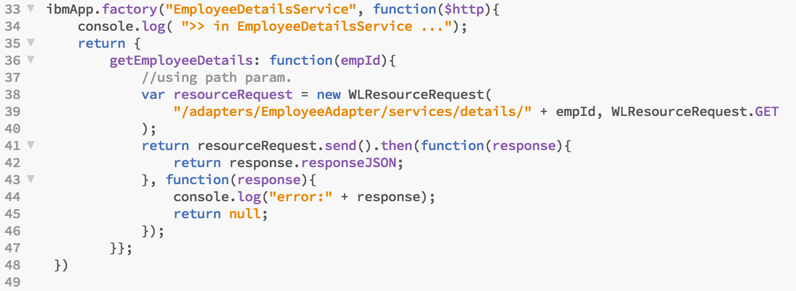
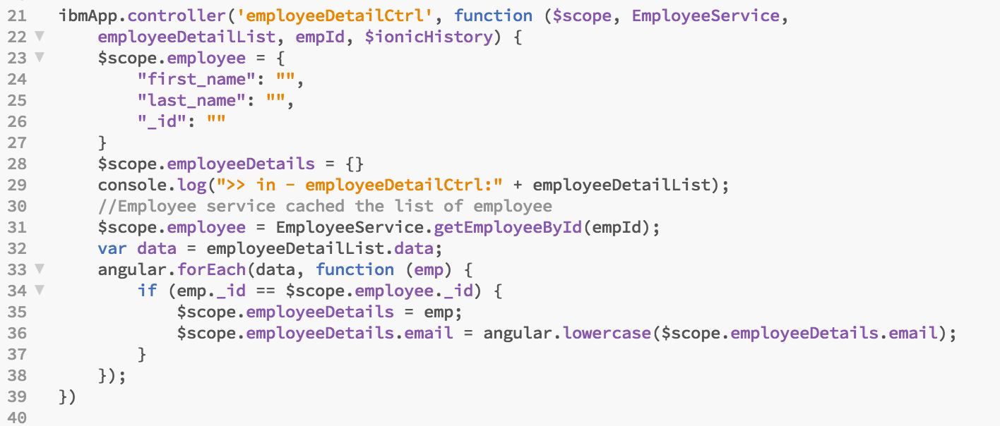
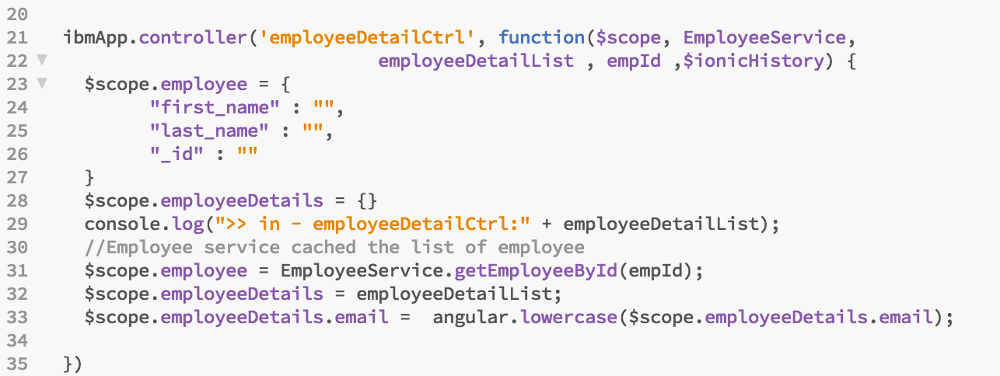

- - -
# Lab 6 - Use the MFP adapter framework (Client side)

With the MFP adapter in place on the server side, you will now add code to the client app to access the adapter.

>Note:  For this lab there are snippets files included in the **/snippets** folder of your workspace which can be used to quickly copy/paste the large source code changes in the lab steps below.

##Steps

###1. Modify app.js to invoke the adapter procedure

The EmployeeService service in app.js returns the list of employees to the controller.  We will replace the Angular **$http** service logic with MobileFirst WLResourceRequest API.  WLResourceRequest is a REST client api provided in the MobileFirst client SDKs (hybrid and native) that integrates with MobileFirst security and analytics.

1. Open the **services.js** file in **IBMEmployeeApp/www/js**.  
2. Find the **EmployeeService** method.  You will replace the method implementation to use MFP Client API instead of the Angular $http services.
3. Replace the implementation of the **EmployeeAdapter** method with the code, below (*use the corresponding snippet file in **/snippets** to copy/paste*):

   ``` javascript
     
     ibmApp.factory("EmployeeService", function($http){
        console.log( ">> in EmployeeService ...");
        var employees = [];
        var resourceRequest = new WLResourceRequest(
            "/adapters/EmployeeServices/services/list", WLResourceRequest.GET
        );
        return {
            getEmployeeList: function(){
                return resourceRequest.send().then(function(response){
                    employees = response.responseJSON;
                    return employees;
                }, function(response){
                    console.log("error:" + response);
                    return null;
                });
            },
            getEmployee: function(index){
                return employees[index];
            },
            getEmployeeById: function(id){
                var _emp;
                angular.forEach(employees, function(emp) {
                    console.log(">> getEmployeeById :" + id + " ==  " + emp._id );
                    if(emp._id == id){ _emp = emp; }
                });
                return _emp;
            }
        };
    })

   ```
  
  **Screenshot Before:**  
  
  	

  **Screenshot After:**
   
   

4. **Save** your updates!

### 2. Test the changes

1. Return to the command line and ensure you are in the `IBMEmployeeApp` folder 

2. Run the application using

        cordova prepare 
        cordova emulate

   > Note that trying to test the adapter on the MBS or on the Browser will not work, you will have to use the cordova emulate. 
   MBS support will be added at MFP v8.0 GA
   
   > Note: If you are unable to login, you may need to first re-register the application using `mfpdev app register` then issue a `mfpdev app pull` to get the latest configuration. Then perform the above cordova compands again.

3. You should see that the Employee List is populated from the data provided by the MobileFirst Platform adapter.  But, if you tap on any employee you will see that the details are still the template values, not those provided by the adapter.  You will correct that next.


	 


4. Close the **emulator**

###3. Modify the EmployeeDetailsService service to invoke the adapter procedure

EmployeeDetailsService returns details for the specified employee id.  This set of steps will replace the Angular $http processing with WLResourceRequest.

1. Locate the **EmployeeDetailsServices** method in **IBMEmployeeApp/www/js/services.js**.  You will also replace the current Angluar $http implementation of this service with calls to the MobileFirst Client API.  The service only needs to get the employee details as provided by the adapter.  There is no need to parse and massage the data returned from the server. The filtering (heavy lifting) was done on the adapter side.  When you have hundreds or thousands of employees this is huge time saving which done on the server side.

2. Replace the implementation of the **EmployeeDetailsService** method with the code, below (*use the corresponding snippet file in **/snippets** to copy/paste*):

   ``` javascript
      
      ibmApp.factory("EmployeeDetailsService", function($http){
        console.log( ">> in EmployeeDetailsService ...");
        return {
            getEmployeeDetails: function(empId){
                //using path param.
                var resourceRequest = new WLResourceRequest(
                    "/adapters/EmployeeAdapter/services/details/" + empId, WLResourceRequest.GET
                );
                return resourceRequest.send().then(function(response){
                    return response.responseJSON;
                }, function(response){
                    console.log("error:" + response);
                    return null;
                });
            }};
     })
   
   ```
   
    **Before:**

      

    **After:**
   
      
    
3. **Save** your updates!
    
    
###4. Modify the employeeDetailCtrl controller to match the EmployeDetailsService

We no longer need the 'for' loop to parse the complete set of detail data, as our adapter provides a single set of employee detail data for the requested employee id.  We can simplify the client controller to take advantage of having moved that "business logic" to the server.  

This is a very simple example of offloading logic to the adapter tier, but you can imagine much more complex variations with date/time formatting and calculations, phone numbers, mashups of multiple back-end data sources, calculations, etc...  The adapter modularizes the solution, simplifying and reducing the logic required on the mobile device.

1.  Locate the **employeeDetailCtrl** method in **IBMEmployeeApp/www/js/controllers.js**. Replace the implementation of the **employeeDetailCtrl** method with the code, below (*use the corresponding snippet file in **/snippets** to copy/paste*):
 

   ``` javascript
   ibmApp.controller('employeeDetailCtrl', function($scope, EmployeeService,
                                 employeeDetailList , empId ,$ionicHistory) {
      $scope.employee = {
            "first_name" : "",
            "last_name" : "",
            "_id" : ""
      }
      $scope.employeeDetails = {}
      console.log(">> in - employeeDetailCtrl:" + employeeDetailList);
      //Employee service cached the list of employee
      $scope.employee = EmployeeService.getEmployeeById(empId);
      $scope.employeeDetails = employeeDetailList;
      $scope.employeeDetails.email =  angular.lowercase($scope.employeeDetails.email);
   
   })

   ```
  
    **Before:**

      

    **After:**

    
    
2.  **Save** your updates!  

###5. Verify your changes

1. Run the application and view the results

        cordova prepare
        cordova emulate
        
2.  You should now see both the employee list and the employee details are coming from the data supplied by the adapter.

	 


## Summary

In this lab, you modified the client code to use the MobileFirst adapter instead of Angular $http calls to retrieve the employee list and detail data.

If you were unable to complete this lab, you can catch up by running this command:

     git checkout -f step-6
     
.


