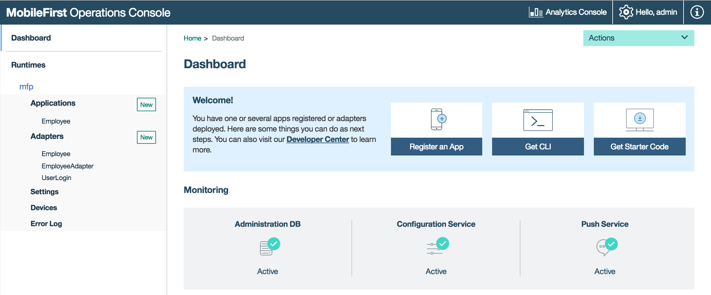
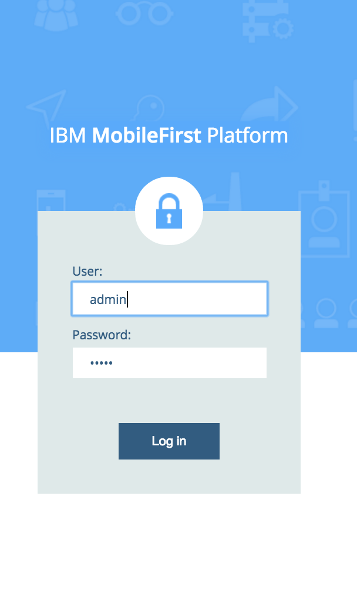
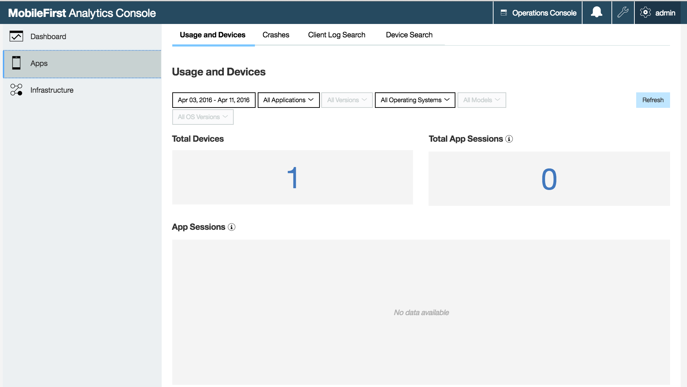
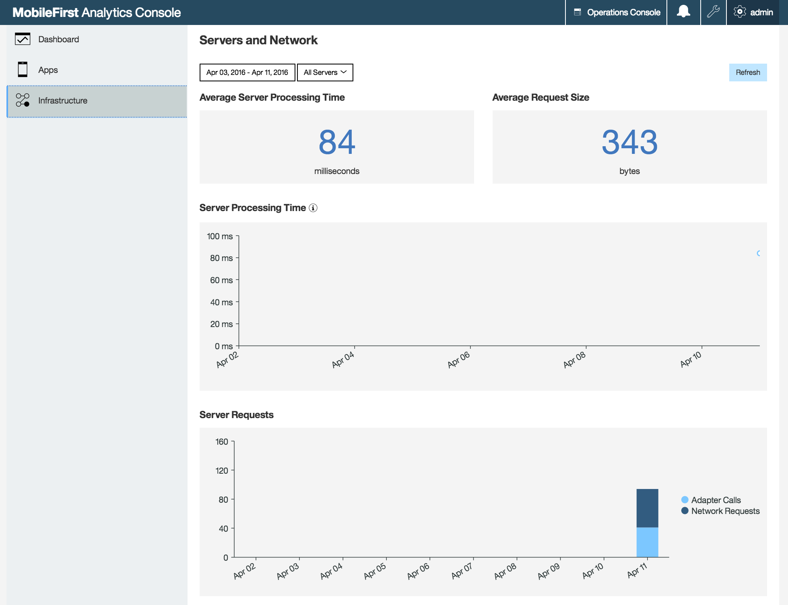
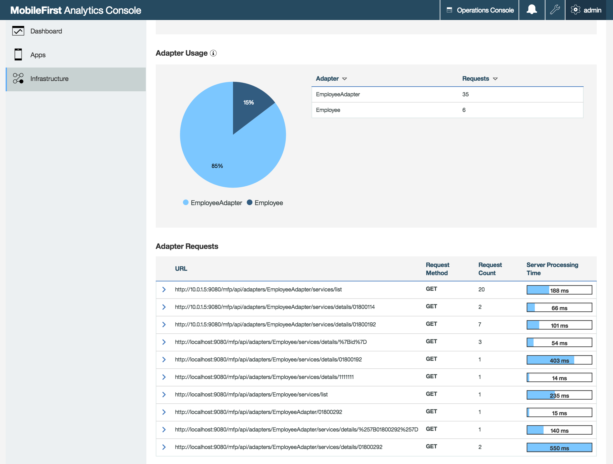

- - -
# Lab7 - Overview MFP Operational Analytics

The next series of labs explore the power of MFP's built-in Operational Analytics feature.  Simply by being a MobileFirst project and connecting to a MobileFirst Platform server, applications automatically forward useful details about the application environment - including device platform distribution, server distribution (in multi-server environments), authentication failures and performance statistics.

In addition, client logs which are invaluable at client-side development time, can also be forwarded and collected at the server for analysis and troubleshooting.

### Operational Analytics architecture

The MobileFirst Operational Analytics server is a separately packaged, no-charge element of the MobileFirst Platform Foundation.  It can run on the same physical server as your MFP server or can be installed on its own node or even clustered for highly-scalable, highly-available monitoring.  It is automatically enabled within the development environment with either the Studio or the Command Line Interface.  We'll be using the instance packaged in the CLI for this set of labs.

The Analytics server is made up of data collection and searching logic plus an Operational Analytics console which allows you to view and manage and search the collected data in a suite of provided views and charts, plus has the capability to generate custom charts with a variety of built-in and custom events. 

### Locate and login to the Analytics Console

Before we continue with the next coding exercise, lets look at the operational analytics console, which provide a wide variety of data about the usage of our application, adapters and more.

If the Operations console is not open in a browser, navigate to the `IBMTechExBackend` folder and issue 
`mfp console`.

From the MobileFirst Operations Console, Click on the ‘Analytics Console’ link on the top right corner.  

When prompted for the user id and password, use the default of admin/admin

### Review the Analytics Console

If you have run the prior exercises, you should see that there is a substantial amount of information provided out-of-the-box on the various tabs and views, without any special effort on your part.  

**Application analytics**

**Server & Network analytics**

**Adapters request analytics**

As we'll see in the next lab, the platform also provides a client-side api that allow you to capture and log your own custom metadata, and generate custom reports for deep insight on application usage.

Go ahead and navigate the different tabs and pages to see the range and types of information collected and available for use in managing your applications, servers and environment.

.

