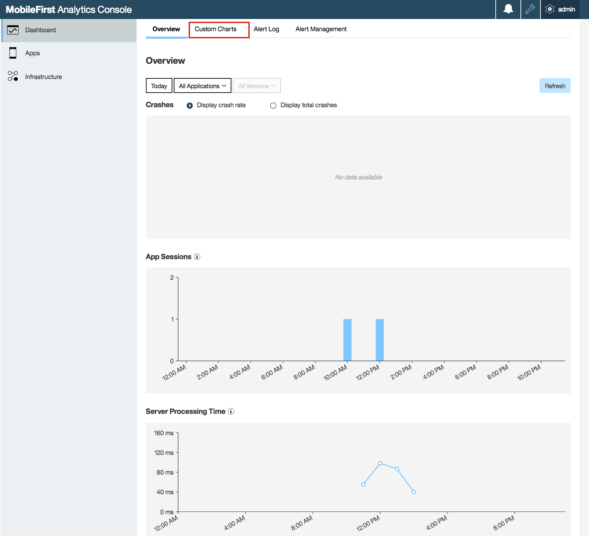
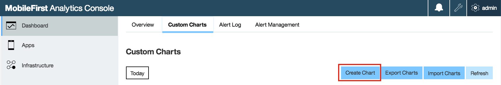
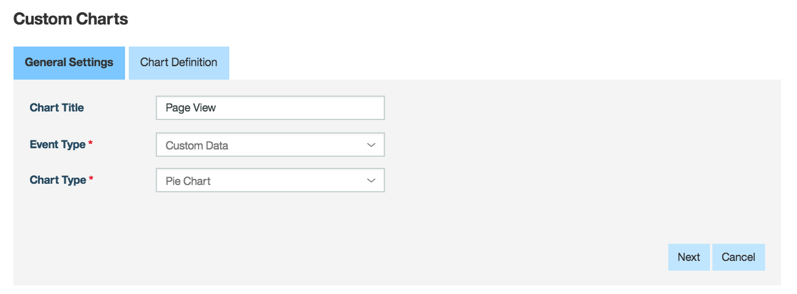
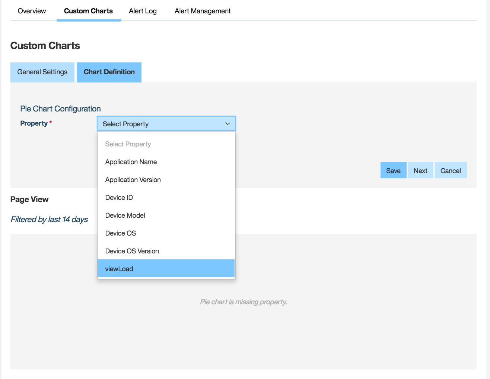
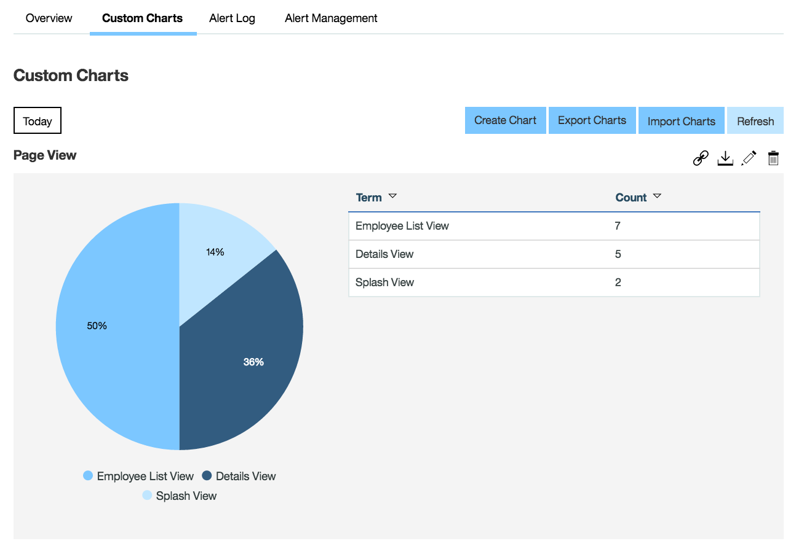

- - -
# Lab9 - How to create custom charts

In this lab you will run the instrumented application to generate analytics data, then use the MobileFirst Analytics Console to create custom charts from the captured data, giving deep insight into how your application is being used by the community.

### Preview the application to generate data

Bring up the application using either the emulator or simulator, with
     
     cordova prepare
     cordova emulate 
     
Navigate across the different views within the application - do this a few times.  Finish by choosing **'Logout'** from the hamburger menu on the right.  This will cause the app to forward (flush) all accumulated analytics data to the MFP server.

### Create a custom chart

Once the app has logged out, you should have a set of captured analytics data on your server.  The following steps will help you locate and generate a custom chart to show the usage patterns within your application. 

If not already open, launch the ‘MobileFirst Analytics Console’ link from the Mobilefirst Operations Console.

Press on the ‘Custom Charts’ link

Then press the ‘Create Chart’ button

Use the following data to complete the chart

     ‘Chart Title’ : Page View

     ‘Event Type’ select : Custom Data

     ‘Chart Type’ select : Pie Chart

Press the ‘Next’ button to move to the 'Chart Definition' tab

For the ‘Property’ select the ‘viewLoad’ event that we captured and press the ‘Save’ button

**NOTE:** You can also define your own Chart Filters if you would like.

Once you save the chart you see it displayed under the custom charts tab :

### Summary

Now you have seen how to easily instrument your application with simple logging calls, which feed usage data to the MobileFirst server and can then be captured and displayed in custom charts.  This gives you a much better understanding of how your customers and/or employees are using your applications.

.

